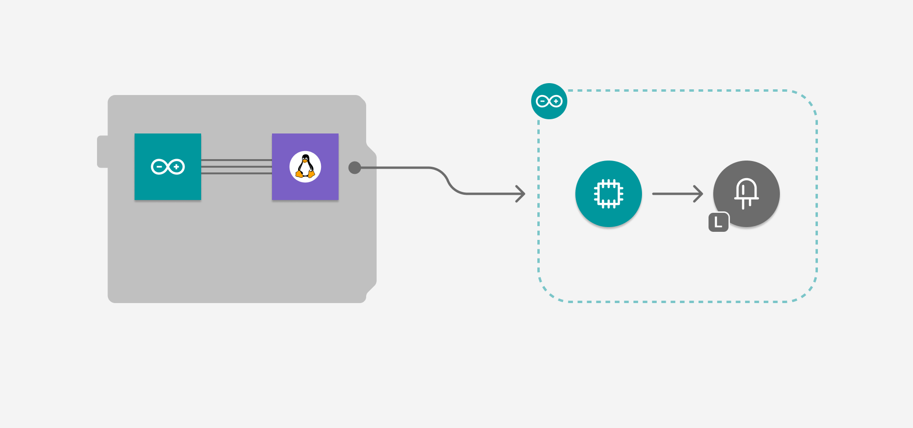

# Blinking an LED from Python

The **Blinking an LED from Python** example toggles the onboard LED state every second. It shows basic LED control using Router Bridge communication between Python® and Arduino.



## Description

This example shows a simple blinking LED application. The Python® script runs a continuous loop that toggles the LED state at regular 1-second intervals. At the same time, the Arduino sketch handles the control of the LED hardware. It provides a foundation for learning basic GPIO control and Router Bridge communication patterns.

The Python® script manages the timing and state logic, while the Arduino sketch controls the LED hardware. The Router Bridge enables communication between the Python® environment and the microcontroller.

## Bricks Used

**This example does not use any Bricks.** It shows direct Router Bridge communication between Python® and Arduino.

## Hardware and Software Requirements

### Hardware

- Arduino UNO Q (x1)
- USB-C® cable (for power and programming) (x1)

### Software

- Arduino App Lab

**Note:** You can also run this example using your Arduino Arduino UNO Q as a Single Board Computer (SBC) using a [USB-C® hub](https://store.arduino.cc/products/usb-c-to-hdmi-multiport-adapter-with-ethernet-and-usb-hub) with a mouse, keyboard and display attached.

## How to Use the Example

1. Run the App
    
2. Watch the LED on the board toggle state every second

## How it Works

Once the application is running, the device performs the following operations:

- **Managing timing and LED state in Python®.**

The Python® script uses a simple loop with timing control:

```python
    from arduino.app_utils import *
    import time
    
    led_state = False
    
    while True:
     time.sleep(1)
     led_state = not led_state
     Bridge.call("set_led_state", led_state)
```

The script toggles the LED state variable every second and sends the new state to the Arduino.

- **Exposing LED control function to Python®.**

The Arduino registers its LED control function with the Router Bridge:

```cpp
    Bridge.provide("set_led_state", set_led_state);
```

- **Controlling the hardware LED.**

The Arduino sketch handles the LED hardware control:

```cpp
    void set_led_state(bool state) {
        digitalWrite(LED_BUILTIN, state ? LOW : HIGH);
    }
```

Note that the logic is inverted (LOW for on, HIGH for off), which is typical for built-in LEDs that are wired with the cathode connected to the pin.

The high-level data flow looks like this:

```
Python® Timer Loop → Router Bridge → Arduino LED Control
```

## Understanding the Code

Here is a brief explanation of the application components:

### 🔧 Backend (`main.py`)

The Python® component manages timing and LED state logic.

- **`import time`:** Provides timing functions for controlling the blink interval.  

- **`led_state = False`:** Tracks the current LED state as a boolean variable.

- **`while True:` loop :** Creates an infinite loop that runs continuously to control the LED timing. 

- **`time.sleep(1)`:** Pauses execution for 1 second between LED state changes.

- **`led_state = not led_state`:** Toggles the LED state by inverting the boolean value.
                      
- **`Bridge.call("set_led_state")`:** Sends the new LED state to the Arduino through the Router Bridge communication system. 

### 🔧 Hardware (`sketch.ino`)

The Arduino code handles LED hardware control and sets up Bridge communication.

- **`pinMode(LED_BUILTIN, OUTPUT)`:** Configures the built-in LED pin as an output for controlling the LED state.

- **`Bridge.begin()`:** Initializes the Router Bridge communication system for receiving commands from Python®.

- **`Bridge.provide(...)`:** Registers the `set_led_state` function to be callable from the Python® script.

- **`set_led_state(bool state)`:** Controls the LED hardware with inverted logic (LOW = on, HIGH = off) typical for built-in LEDs.

- **Empty `loop()`:** The main loop remains empty since all LED control is managed by the Python® script through Bridge function calls. 

## Related Inspirational Examples
- Color your LEDs 
