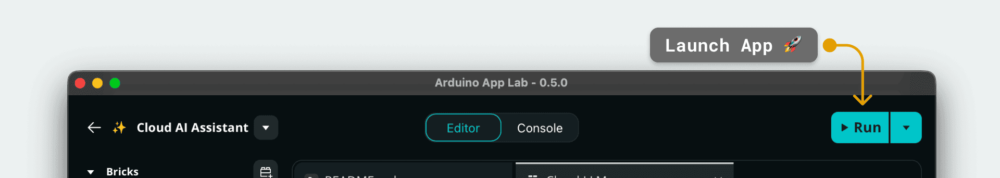

# Blinking an LED


## Description

The **Blinking an LED** example demonstrates how to interact with a surface-mounted LEDs of the Arduino UNO Q from sketch.

This App turns on and off `LED_BUILTIN` which is controllable by the MCU.
The logic is implemented in the Arduino sketch and the interaction with the LED is performed by the microcontroller unit.

## Hardware and Software Requirements

### Hardware

- Arduino UNO Q (x1)
- USB-C® cable (for power and programming) (x1)

### Software

- Arduino App Lab

## How to Use the Example

### Configure & Launch App

1. **Run the App**
   Launch the App by clicking the **Run** button in the top right corner. Wait for the App to start.
   

5. **See the led**
   The `LED_BUILTIN` will start blinking red

## How it Works

Once the App is running, the `LED_BUILTIN` is turn on and off with a duty cycle of 1 second.

## Understanding the Code

### 🔧 Hardware (`sketch.ino`)

The Arduino Sketch script handles the logic of turning on and off the `LED_BUILTIN`.

- **Initialization**: The `setup()` function initialize the pin `LED_BUILTIN` as a Digital Output
```cpp
void setup() {
  // initialize digital pin LED_BUILTIN as an output.
  pinMode(LED_BUILTIN, OUTPUT);
}
```

- **Execution**: The `loop()` function contains the logic to turn on and off the sketch. Is is continuously and rapidatelly executed.

```cpp
void loop() {
  // put your main code here, to run repeatedly:
  digitalWrite(LED_BUILTIN, HIGH);   // turn the LED_BUILTIN on (HIGH is the voltage level)
  delay(1000);                       // wait for a second
  digitalWrite(LED_BUILTIN, LOW);    // turn the LED_BUILTIN off by making the voltage LOW
  delay(1000);                       // wait for a second
}
```
Note that the logic is inverted (LOW for on, HIGH for off), which is typical for built-in LEDs that are wired with the cathode connected to the pin.

## Related Inspirational Examples
- Color your LEDs 
