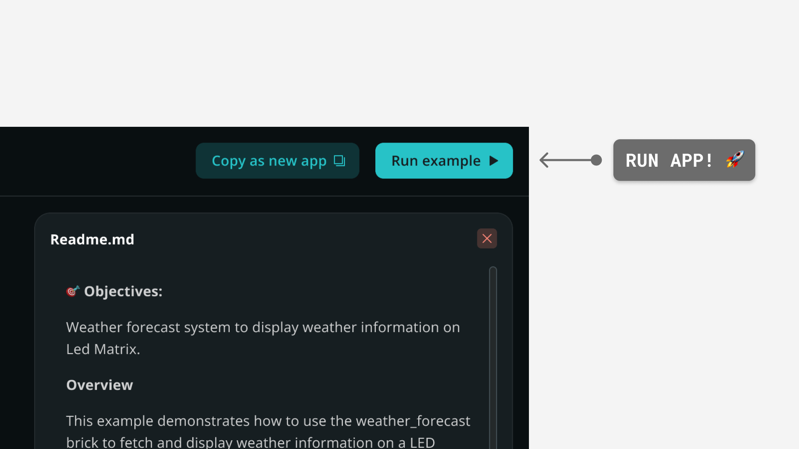

# HTTPS Web UI

The **HTTPS Web UI** example demonstrates how to serve the Web UI over HTTPS using the WebUI brick with TLS (Transport Layer Security) enabled.

## Description

This example shows how to use the WebUI brick to serve the web interface securely over HTTPS with TLS encryption enabled. The application initializes a web server that serves the frontend files from the `assets` folder using a self-signed certificate generated on-the-fly, or custom certificates if provided.

The `assets` folder contains the **frontend** components of the application, including HTML and CSS files along with JavaScript files that make up the web user interface. The `python` folder includes the application **backend** which manages the secure HTTPS server.

## Bricks Used

This example uses the following Bricks:

- `web_ui`: Brick to create a web interface and send dynamic messages from the backend to the frontend.

## Hardware and Software Requirements

### Hardware

- Arduino UNO Q (x1)
- USB-C® cable (for power and programming) (x1)

### Software

- Arduino App Lab

**Note:** You can run this example using your Arduino UNO Q as a Single Board Computer (SBC) using a [USB-C® hub](https://store.arduino.cc/products/usb-c-to-hdmi-multiport-adapter-with-ethernet-and-usb-hub) with a mouse, keyboard and display attached.

## How to Use the Example

1. Run the App
   
2. Open the App in your browser at `https://<UNO-Q-IP-ADDRESS>:7000`
3. Accept the security warning (since the certificate is self-signed) and proceed to the secure website

## How it Works

Once the application is running, the device performs the following operations:

- **Initializing the WebUI server with TLS:** The WebUI brick starts a secure web server on port 7000 with TLS encryption enabled.
- **Certificate generation:** On the first run, the application generates a self-signed certificate on-the-fly if custom certificates are not provided.
- **Serving secure content:** The application serves all content from the `assets` folder over the HTTPS protocol, ensuring encrypted communication between the client and server.
- **Custom certificate support:** Users can optionally provide their own certificates (cert.pem and key.pem) by placing them in the `cert` folder and specifying the path when initializing the WebUI.
**Please note** the certificate and the private key must be in .pem format and the files must be `cert.pem` and `key.pem`

## Understanding the Code

Here is a brief explanation of the application components:

### 🔧 Backend (`main.py`)

The Python code demonstrates how to configure and run a secure HTTPS web server:

- **`from arduino.app_utils import *`:** Imports the required application utilities.

- **`from arduino.app_bricks.web_ui import WebUI`:** Imports the WebUI brick class for managing the web server.

- **`ui = WebUI(use_tls=True)`:** Initializes the web server with TLS encryption enabled. By default, it serves all content from the `assets` folder of the application.

- **`use_tls=True`:** Parameter that enables HTTPS/TLS security for the web server. When enabled, a self-signed certificate is generated automatically if no custom certificates are provided.

- **`certs_dir_path`:** Optional parameter to specify the path to custom certificate files (cert.pem and key.pem). If not specified, a self-signed certificate is generated on-the-fly.

- **`App.run()`:** Starts the application and begins serving the Web UI securely over HTTPS.

### 🔧 Frontend (`index.html` + `app.js`)

## Related Inspirational Examples
