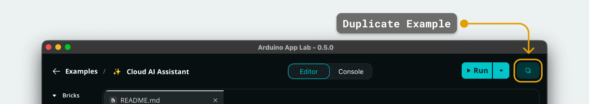
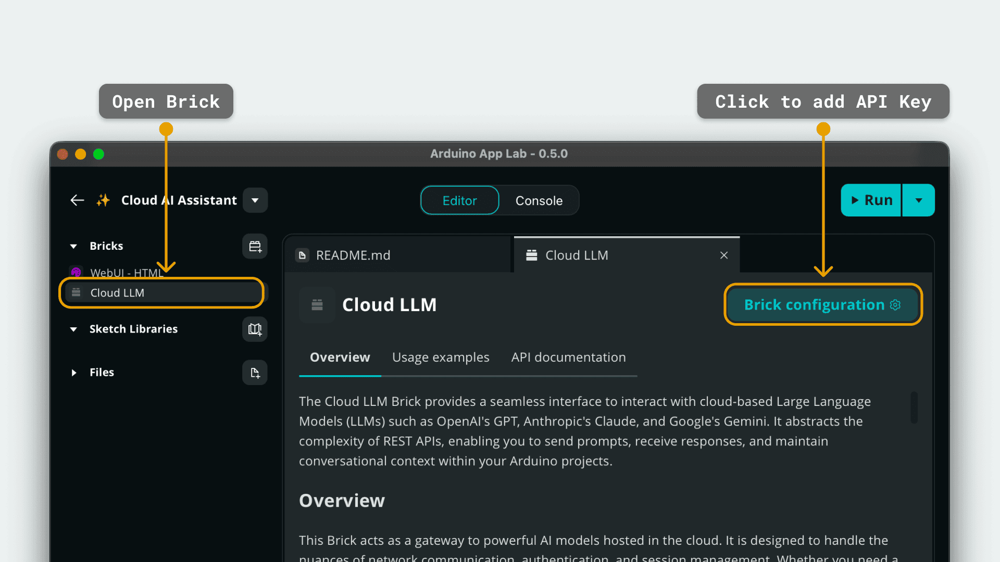
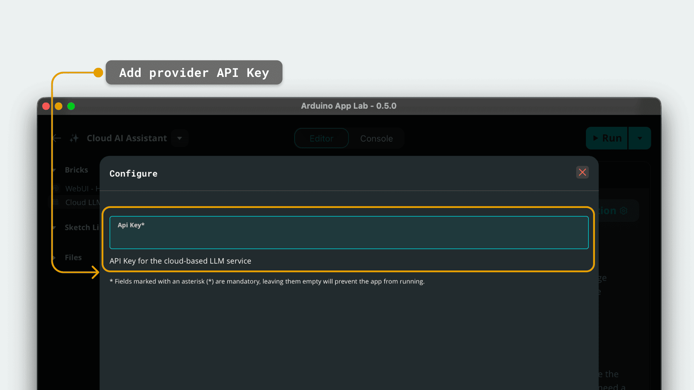

# Cloud AI Assistant

The **Cloud AI Assistant** example demonstrates how to build a generative AI chatbot using the Arduino UNO Q. It uses a Large Language Model (LLM) to create a chatbot that helps you in your daily life.

## Description

This App transforms the UNO Q into an AI assistant. It uses the `cloud_llm` Brick to connect to a cloud-based AI model and the `web_ui` Brick to provide a rich configuration interface.

The interface comes with some pre-built prompts and a free text area, the thread of messages is developed according to a chat style: your enquires on the right and the AI replies on the left. 
Morover, there are some tips buttons that help you in building your prompts in the input text area.

## Bricks Used

The cloud AI Assistant example uses the following Bricks:

- `cloud_llm`: Brick to interact with cloud-based Large Language Models (LLMs) like Google Gemini, OpenAI GPT, or Anthropic Claude.
- `web_ui`: Brick to create the web interface for parameter input and story display.

## Hardware and Software Requirements

### Hardware

- Arduino UNO Q (x1)
- USB-C® cable (for power and programming) (x1)

### Software

- Arduino App Lab

**Note:** This example requires an active internet connection to reach the AI provider's API. You will also need a valid **API Key** for the service used (e.g., Google AI Studio API Key).

## How to Use the Example

This example requires a valid API Key from an LLM provider (Google Gemini, OpenAI GPT, or Anthropic Claude) and an internet connection.

### Configure & Launch App

1. **Duplicate the Example**
   Since built-in examples are read-only, you must duplicate this App to edit the configuration. Click the arrow next to the App name and select **Duplicate** or click the **Copy and edit app** button on the top right corner of the App page.
   

2. **Open Brick Configuration**
   On the App page, locate the **Bricks** section on the left. Click on the **Cloud LLM** Brick, then click the **Brick Configuration** button on the right side of the screen.
   

3. **Add API Key**
   In the configuration panel, enter your API Key into the corresponding field. This securely saves your credentials for the App to use. You can generate an API key from your preferred provider:
   *   **Google Gemini:** [Get API Key](https://aistudio.google.com/app/apikey)
   *   **OpenAI GPT:** [Get API Key](https://platform.openai.com/api-keys)
   *   **Anthropic Claude:** [Get API Key](https://console.anthropic.com/settings/keys)

   

4. **Run the App**
   Launch the App by clicking the **Run** button in the top right corner. Wait for the App to start.
   

5. **Access the Web Interface**
   Open the App in your browser at `<UNO-Q-IP-ADDRESS>:7000`.

### Interacting with the App

1. **Choose Your Card**
   You have the opportunity to start a conversation with the AI starting from pre-built prompt or submitting your own question.

2. **Chat page**
   In the chat page you can have a conversation with the AI. 
   Your enquires are on the left and the AI replies on the right in a chat-like style.

3. **Enhance your prompt**
   Click on the tips buttons to enhance your prompts to make them more sofisticated.
   The text inside the clicked button will be appended to your prompt in the text area.

4. **Interact**
   The AI responses are streamed in real-time. Once complete, you can:
   - **Continue on that topic** asking more questions.
   - Click **Reset chat** to reset the interface and start over.

## How it Works

Once the App is running, it performs the following operations:

- **Chatbot UI**: The `web_ui` Brick serves an HTML page where users can interact with the LLM in a chat-like style.
- **AI Inference**: The `cloud_llm` Brick sends this prompt to the configured cloud provider using the API Key set in the Brick Configuration.
- **Stream Processing**: Instead of waiting for the full text, the backend receives the response in chunks (tokens) and forwards them immediately to the frontend via WebSockets, ensuring the user sees progress instantly.

## Understanding the Code

### 🔧 Backend (`main.py`)

The Python script handles the logic of connecting to the AI and managing the data flow. Note that the API Key is not hardcoded; it is retrieved automatically from the Brick configuration.

- **Initialization**: The `CloudLLM` is set up with a system prompt that enforces HTML formatting for the output. The `CloudModel` constants map to specific efficient model versions:
  *   `CloudModel.GOOGLE_GEMINI` → `gemini-2.5-flash`
  *   `CloudModel.OPENAI_GPT` → `gpt-4o-mini`
  *   `CloudModel.ANTHROPIC_CLAUDE` → `claude-3-7-sonnet-latest`

```python
# The API Key is loaded automatically from the Brick Configuration
llm = CloudLLM(
                model=CloudModel.GOOGLE_GEMINI,
                system_prompt=load_system_prompt()
            )

llm.with_memory(20)
```

- **Prompt execution**: The `generate_prompt` function gets the prompt from the user and queries the LLM. The LLM response is streamed to the UI with the function `ui.send_message("response", resp)`

```python
def generate_prompt(_, data):
    try:
        prompt = data.get('prompt', '')
        # Use the plain text prompt for the LLM and stream the response
        for resp in llm.chat_stream(prompt):
            ui.send_message("response", resp)

        # Signal the end of the stream
        ui.send_message("stream_end", {})
    except Exception as e:
        ui.send_message("llm_error", {"error": str(e)})
```

### 🔧 Frontend (`app.js`)

The JavaScript manages the complex UI interactions, buttons, and WebSocket communication.

- **Socket Listeners**: The frontend listens for chunks of text and appends them to the display buffer, creating the streaming effect.

```javascript

function initSocketIO() {
    socket.on('response', handleResponse);
    socket.on('stream_end', handleStreamEnd);
    ```omissis```
}

function handleResponse(data) {
    const ai_msg = document.getElementById('active-ai-response');
    if (thinkingMessageElement) {
        // First chunk of stream
        const textContent = thinkingMessageElement.querySelector('.text-content');
        if (textContent) {
            textContent.innerHTML = '';
        }
        thinkingMessageElement.classList.remove('thinking-message');
        thinkingMessageElement.dataset.rawText = '';
        thinkingMessageElement = null;
    }

    if (ai_msg) {
        ai_msg.dataset.rawText += data;
        const textContent = ai_msg.querySelector('.text-content');
        if (textContent) {
            textContent.innerHTML = marked.parse(ai_msg.dataset.rawText);
        }
    }
}

function handleStreamEnd() {
    removeThinkingMessage(); // Ensure it's removed if stream ends
    ai_msg = document.getElementById('active-ai-response');
    if (ai_msg) {
        ai_msg.id = '';
    }
    if (sendButton) {
        sendButton.classList.remove('sending-state');
        if (sendButtonImg) {
            sendButtonImg.src = 'img/send.svg';
        }
    }
    updateSendButtonState(); // Update button state after stream ends
    updateClearChatButtonState(); // Update clear chat button state after stream ends
}
```