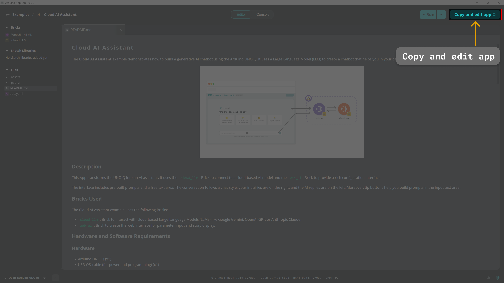
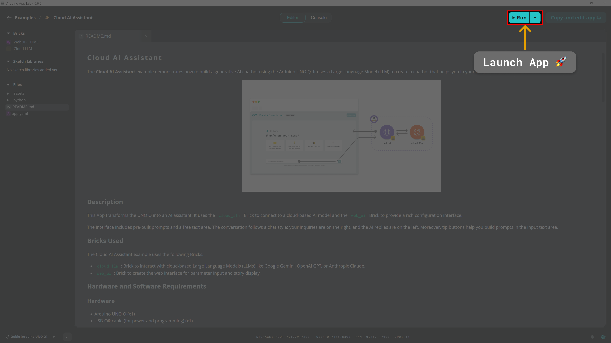

# Edge Dictation Assistant

The **Edge Dictation Assistant** example creates a simple dictation assistant that converts your speech to text and displays it on a UI, using the Arduino® VENTUNO™ Q.

## Description

This App uses AI to dictate the audio captured with the microphone and the VENTUNO Q. It uses the `asr` Brick which uses a local model, with support for real-time processing. And the `web_ui` Brick to provide a recording and text interface.

## Bricks Used

The Edge Dictation Assistant example uses the following Bricks:

- `asr`: Brick that provides on-device automatic speech recognition (ASR) capabilities for the audio stream. It offers a high-level interface for transcribing audio using a local model, with support for both real-time audio capture and batch processing.
- `web_ui`: Brick to create the audio recording web interface.

## Hardware and Software Requirements

### Hardware

- Arduino VENTUNO Q (x1)
- USB-C® cable (for power and programming) (x1)
- [USB-C® hub](https://store.arduino.cc/products/usb-c-to-hdmi-multiport-adapter-with-ethernet-and-usb-hub)
- USB microphone (or headset)
- A power supply (5 V, 3 A) for the USB hub (e.g. a phone charger)

### Software

- Arduino App Lab

## How to Use the Example

### Hardware Setup

1. Connect an USB-C® hub to the board
2. Connect a USB microphone or headset to the USB-C® hub.
3. Power the USB-C hub from a 5V power source (e.g. phone charger).


### Configure & Launch App

1. **Duplicate the Example**
   Since built-in examples are read-only, you must duplicate this App to edit the configuration. Click the arrow next to the App name and select **Duplicate** or click the **Copy and edit app** button on the top right corner of the App page.
   

2. **Run the App**
   Launch the App by clicking the **Run** button in the top right corner. Wait for the App to start.
   

3. **Access the Web Interface**
   Open the App in your browser at `<VENTUNO-IP-ADDRESS>:7000`.

### Interacting with the App
1. **Language selection**
   The UI let you select a language to be recognized. English language is selected by default.

2. **Start dictation**
   On the UI interface press the microphone button to start collecting audio from the microphone connected to the VENTUNO. The dictation will automatically start showing on the UI.

3. **Pause dictation**
   On the UI interface press the pause button to stop transcribing audio to the UI. To resume the dictation press the microphone button again.

4. **Copy or start new dictation**
   After the dictation is finished you can hit the copy button to quickly copy the dictation result. Otherwise press the new recording button to start a new dictation process. You can also select another language to be transcribed.

## How it Works

Once the App is running, it performs the following operations:

- **Dictation UI**: The `web_ui` Brick creates an HTML page where users can interact with the dictation process.
- **ASR Inference**: The `asr` Brick sends the audio to the automatic speech recognition engine that processes the audio and gives back the dictation on the UI.

## Understanding the Code

### 🔧 Backend (`main.py`)

The Python® script handles the logic of connecting to the speech recognition brick and managing the data flow.

- **Initialization**: The `AutomaticSpeechRecognition` brick is set up easily and it instanciate a microphone internally. Also a `WebUI` brick instance is created.

```python
asr = AutomaticSpeechRecognition()
ui = WebUI()
```

- **Set Language**: The App exposes a simple callback for the UI to select a language for automatic speech recognition and set it a brick's property.

```python
def set_language(session_id, data):
    asr.language = data["language"]
```

- **Start Dictation**: This callback starts the transcribe stream method of the ASR brick sending messages to the UI. This method send both partial and full text transcription type of messages. The frontend takes care of their handling.

```python
def start_dictation(session_id, data):
    stream = asr.transcribe_mic_stream()
    for chunk in stream:
        ui.send_message("transcription", {"type": chunk.type, "text": chunk.data})
```

- **Stop Dictation**: This callback stops the asr dictation.

```python
def stop_dictation(session_id, data):
    asr.cancel()
```

- **New Recording**: This callback wraps `stop_dictation()`, exposing proper functionality for the "new recording" event on frontend side.

### 💻 Frontend (`app.js`)

The JavaScript manages UI interactions, language selection, recording state, and communication with the backend via the `WebUI` class.

**Recording toggle**: starts or stops dictation and updates the UI state accordingly:

```javascript
function toggleRecording() {
  if (!isRecording) {
    isRecording = true;
    ui.send_message('start_dictation');
    content.setAttribute('data-state', 'recording');
    resetSilenceTimer();
    resetTranscriptionTimer();
  } else {
    isRecording = false;
    ui.send_message('stop_dictation');
    partialText.textContent = '';
  }
}
```

**Transcription handler**: receives partial and full transcription chunks from the backend and updates the UI in real time:

```javascript
function onTranscription(data) {
  if (!isRecording) return;

  if (data.type === 'partial_text') {
    partialText.textContent = resultText ? ` ${data.text}` : data.text;
  } else if (data.type === 'full_text') {
    const trimmedText = data.text.trim();
    if (trimmedText) {
      resultText = resultText ? `${resultText} ${trimmedText}` : trimmedText;
      fullText.textContent = resultText;
    }
    partialText.textContent = '';
  }

  resetSilenceTimer();
}
```

**Language picker**: lets the user choose the transcription language; the selection is sent to the backend immediately:

```javascript
function selectLanguageOption(option) {
  selectedLanguage = option.getAttribute('data-lang');
  ui.send_message('set_language', { language: selectedLanguage });
}
```

**Auto-stop on silence** — if no transcription is received for `DICTATION_ENDED_TIMEOUT_MS` (20 s), recording stops automatically:

```javascript
function resetSilenceTimer() {
  clearTimeout(silenceTimer);
  silenceTimer = setTimeout(() => {
    if (isRecording) {
      toggleRecording();
      content.setAttribute('data-state', 'ended');
    }
  }, DICTATION_ENDED_TIMEOUT_MS);
}
```
