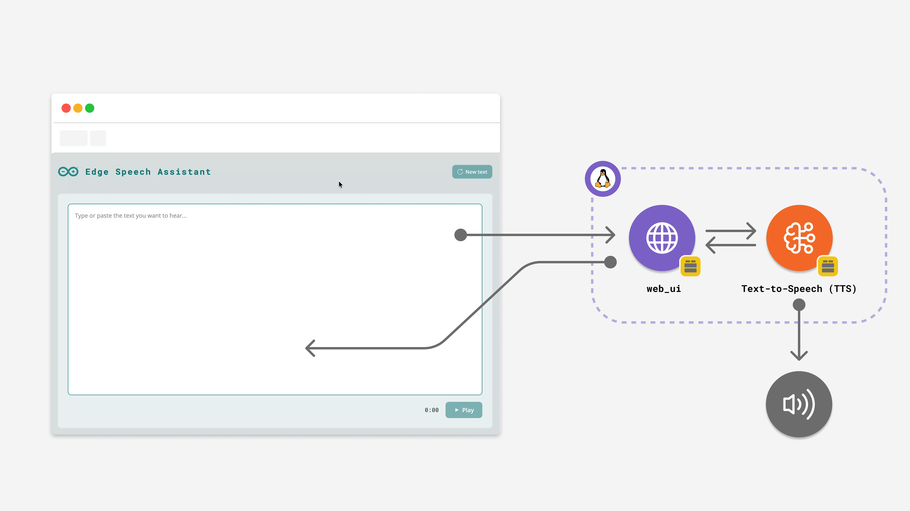
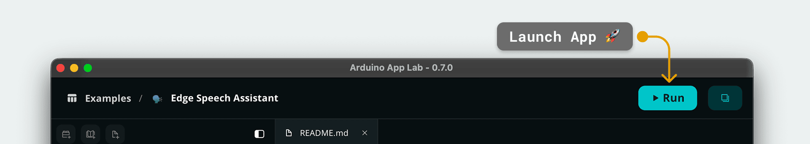
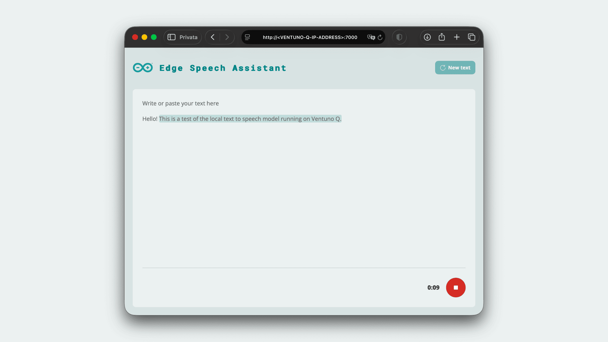

# Edge Speech Assistant

The **Edge Speech Assistant** example turns the Arduino® VENTUNO Q into a fully offline text-to-speech device that converts any text you type into spoken audio played through a connected speaker.



## Description

This App provides a clean web interface where you can paste or type any text and have it read aloud, with everything running locally on the board. There is no cloud round-trip, no account, and no internet connection required at inference time, which keeps your data private and the latency low.

The backend uses the `tts` Brick to synthesize speech with an on-device MeloTTS model and streams the audio to a USB speaker through ALSA. The frontend, served by the `web_ui` Brick, gives you a Play/Stop control, an elapsed-time counter, and a Reset button so you can quickly iterate on the text you want to hear.

Key features include:

- **Fully offline synthesis:** Speech is generated locally by an AI model running on the VENTUNO Q.
- **Long text support:** Short inputs are sent in a single request; longer text is split at sentence boundaries before being handed off to the synthesizer.
- **Stop on demand:** A single button toggles between Play and Stop so you can interrupt playback at any time.

## Bricks Used

The Edge Speech Assistant example uses the following Bricks:

- `tts`: Offline text-to-speech Brick that synthesizes speech locally and plays it through a connected speaker.
- `web_ui`: Brick that hosts the HTML interface and the messaging channel used to send text and receive playback status.

## Hardware and Software Requirements

### Hardware

- Arduino VENTUNO Q (x1)
- USB-C® cable (for power and programming) (x1)
- USB-A speaker or headset (x1)

### Software

- Arduino App Lab

**Note:** This example needs a USB speaker connected to the VENTUNO Q. The `tts` Brick targets the first USB speaker it finds (`usb:1`) by default and will fail to start if no USB speaker is plugged in.

## How to Use the Example

1. **Connect a USB Speaker**

   Plug a USB speaker into the VENTUNO Q before launching the App so the `tts` Brick can find it during start-up.

2. **Launch the App**

   Open the App in App Lab and click the **Run** button in the top right corner. The first launch downloads the audio container and the MeloTTS model, so it can take a few minutes.

   

3. **Open the Web Interface**

   Once the App is running, open `http://<VENTUNO-Q-IP-ADDRESS>:7000` in your browser, or `http://localhost:7000` if you are accessing it from the board itself.

   > Your IP address is shown at the bottom panel of the Arduino App Lab Editor. Note that your board needs to be connected to the same network as your host device.

4. **Type Text and Press Play**

   Type or paste the text you want to hear into the text area. Click **Play** to start synthesis; the timer shows elapsed playback time. Click **Stop** to interrupt at any moment, or **New text** to clear the editor and start over.

   

## How it Works

Once the application is running, the device performs the following operations:

```
                ──▶ "speak" / "stop" ──▶
  Browser                                  web_ui Brick  ──▶  main.py
                ◀── "speaking" events ──                        │
                                                                ▼
                                                         tts Brick (Python)
                                                                │ HTTP POST /tts/synthesize
                                                                ▼
                                                       audio-analytics container
                                                         (MeloTTS on QNN DSP)
                                                                │ PCM audio
                                                                ▼
                                                         ALSA  ──▶  USB Speaker
```

1. The browser instantiates the `WebUI` helper, which opens a Socket.IO connection to the `web_ui` Brick under the hood, and calls `ui.send_message('speak', { text })` with the text typed by the user.
2. `main.py` receives the event and forwards the text to the `tts` Brick. Short inputs are passed straight through; longer text is split at sentence boundaries first so each request stays within the synthesizer's per-call size limit.
3. The `tts` Brick calls the local audio-analytics REST API (`http://audio-analytics-runner:8085`) which runs the MeloTTS model on the Qualcomm® DSP and returns raw PCM audio.
4. The Brick writes the PCM stream to ALSA, which routes it to the USB speaker.
5. The backend emits a `speaking` status message (`started` when synthesis begins, `finished` when it ends or is stopped). The frontend listens with `ui.on_message('speaking', ...)` to drive the Play/Stop toggle and the elapsed-time counter.

The MeloTTS model and the audio analytics service are managed by the `tts` Brick, so the App does not need any model files of its own.

## Understanding the Code

Here is a brief explanation of the App components:

### 🔧 Backend (`main.py`)

The Python® backend is small: it wires the `web_ui` events to the `tts` Brick and adds a chunking helper for long inputs.

- **Initialization**: Both Bricks are created with no arguments. The `tts` Brick auto-detects the first USB speaker and connects to the audio-analytics service.

  ```python
  from arduino.app_bricks.tts import TextToSpeech
  from arduino.app_bricks.web_ui import WebUI
  from arduino.app_utils import App

  tts = TextToSpeech()
  ui = WebUI()
  ```

- **Chunking long text**: Short inputs are sent to the `tts` Brick as a single request. When the text exceeds the per-call size limit, the handler splits it at the last sentence boundary (`.!?`) that fits in the window and repeats until the remainder is short enough.

  ```python
  TTS_MAX_BYTES = 1024

  chunks = []
  while len(text.encode("utf-8")) > TTS_MAX_BYTES:
      window = text.encode("utf-8")[:TTS_MAX_BYTES].decode("utf-8", errors="ignore")
      match = re.search(r"[.!?][^.!?]*$", window)
      cut = match.start() + 1 if match else len(window)
      chunks.append(text[:cut].strip())
      text = text[cut:].strip()
  if text:
      chunks.append(text)
  ```

- **Playback loop with stop support**: A `threading.Event` lets the `stop` handler interrupt the loop between chunks. The backend sends a `started` status before the first chunk and a `finished` status when the loop ends.

  ```python
  ui.send_message("speaking", {"status": "started"})
  for chunk in chunks:
      if stop_event.is_set():
          break
      if chunk.strip():
          tts.speak(chunk)
  ui.send_message("speaking", {"status": "finished"})
  ```

- **Event registration**: Incoming `web_ui` messages are bound to the handlers and the App is started.

  ```python
  ui.on_message("speak", speak)
  ui.on_message("stop", stop)

  App.run()
  ```

### 💻 Frontend (`index.html` + `app.js`)

The page is a single-screen editor with a Play/Stop toggle button and an elapsed-time counter. The frontend talks to the backend through a `WebUI` helper class (`assets/libs/arduino.js`) that wraps the underlying Socket.IO client and exposes the same `send_message` / `on_message` shape as the Python side — so you never write `socket.emit` or `socket.on` directly in `app.js`.

- **Connecting to the brick**: A single line creates the connection and the helper takes care of the Socket.IO handshake.

  ```javascript
  const ui = new WebUI();
  ```

- **Sending text**: When the user presses Play, the frontend sends a `speak` message with the current textarea value. Pressing the same button while speaking sends `stop` instead.

  ```javascript
  playStopButton.addEventListener('click', () => {
      if (isSpeaking) {
          ui.send_message('stop');
      } else {
          const text = textInput.value.trim();
          if (text) {
              ui.send_message('speak', { text });
          }
      }
  });
  ```

- **Status synchronization**: The backend's `speaking` messages drive the icon, the timer, and the disabled state of the controls so the UI always reflects what the synthesizer is actually doing.

  ```javascript
  ui.on_message('speaking', (data) => {
      if (data.status === 'started') {
          isSpeaking = true;
          startTimer();
          updateControls();
      } else if (data.status === 'finished') {
          isSpeaking = false;
          stopTimer();
          updateControls();
      }
  });
  ```

## Troubleshooting

### No audio comes out of the speaker

**Fix:** Open a terminal on the board and run `aplay -l` to confirm that the USB speaker is connected and visible. The `tts` Brick targets `usb:1` by default and will fail with `No USB speakers found` if no USB speaker is present.

### App start fails with "Speaker is busy"

**Fix:** Another audio service is already holding the device exclusively (PipeWire or PulseAudio from a desktop session is the most common cause). Stop the conflicting service or run the board in headless mode so the `tts` Brick can open the speaker.

