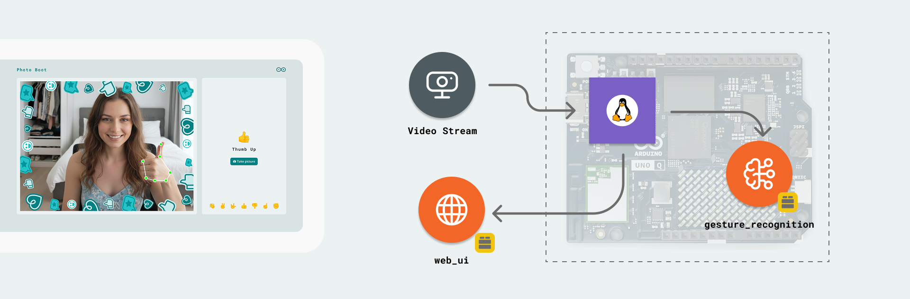
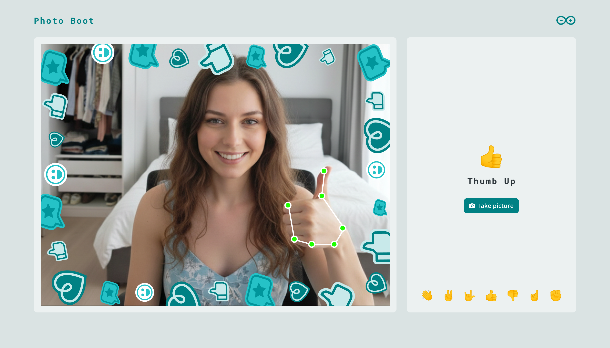
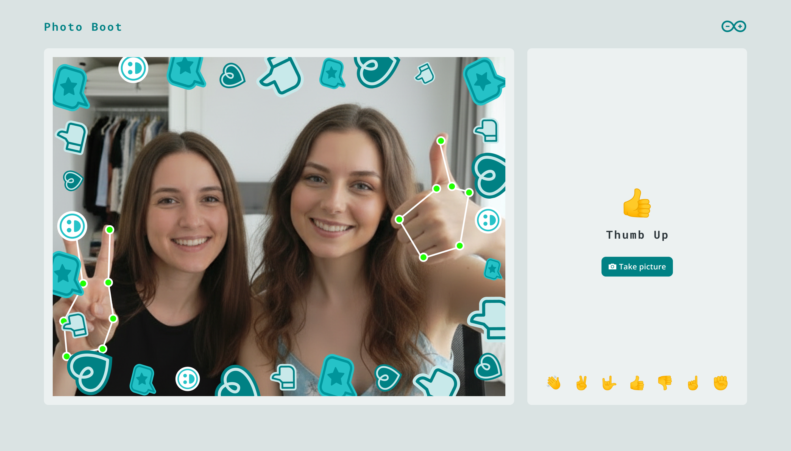
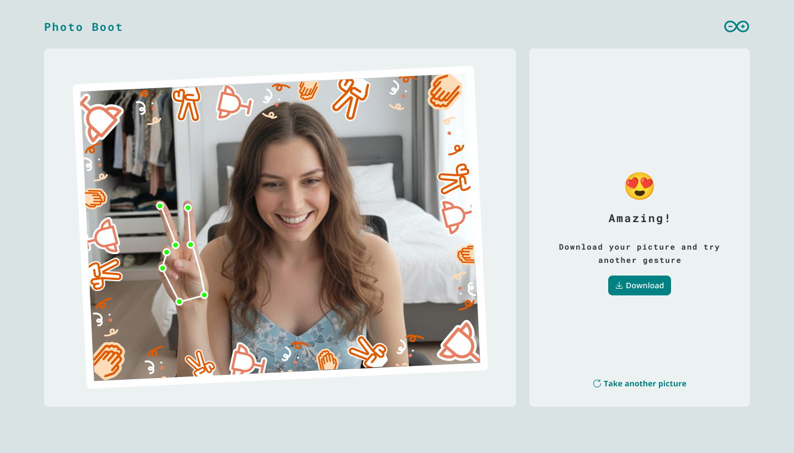
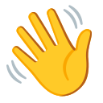
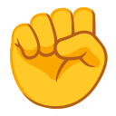
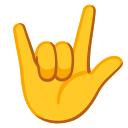

# Gesture Booth

The **Gesture Booth** example uses the camera and a gesture recognition model to detect hand gestures in real-time. It features a web-based interface that provides visual feedback when a gesture is recognized and allows users to interact with the application using their hands.



## Description

This example demonstrates real-time gesture recognition using the `gesture_recognition` Brick. The Python script captures video from the camera, processes it through the gesture recognition model, and sends the detected gesture to a web UI. The web UI displays the live camera feed and interactive elements that respond to the recognized gestures like "Open Palm", "Victory", "Thumb Up", and more.

If the user changes their gesture, the frame asset changes accordingly to provide immediate visual feedback.



The model can recognize up to 2 gestures simultaneously. If 2 gestures are recognized, landmarks on the hands will appear for both. However, the first gesture to be recognized rules the frame asset and is the one shown in the right-hand UI container.



When the user takes a picture, the final downloadable image will include a frame with assets related to the detected gesture.



The `assets` folder contains the web interface components (HTML, CSS, JavaScript) and various SVG icons for the gestures. In the `python` folder, you will find the main script that coordinates the camera, the gesture recognition model, and the web communication.

This example runs entirely on the Arduino® Uno Q or Arduino® VENTUNO™ Q, utilizing its processing power for both the AI model and the web server.

## Bricks Used

The Gesture Booth example uses the following Bricks:

- `gesture_recognition`: Brick to detect and recognize hand gestures from a camera feed.
- `web_ui`: Brick to create a web interface for displaying the camera feed and gesture feedback.

## Hardware and Software Requirements

### Hardware

- Arduino® Uno Q or Arduino® VENTUNO™ Q (x1)
- USB-C® cable (x1)
- Camera (Integrated or USB camera)

### Software

- Arduino App Lab

**Note:** You can also run this example using your Arduino® Uno Q or Arduino® VENTUNO™ Q as a Single Board Computer (SBC) using a [USB-C® hub](https://store.arduino.cc/products/usb-c-to-hdmi-multiport-adapter-with-ethernet-and-usb-hub) with a mouse, keyboard and display attached.

## How to Use the Example

1. Run the App.
2. Open the App in your browser.
3. Allow camera access if prompted.
4. Position your hand in front of the camera.
5. Try one of the supported gestures:
   - **Open Palm** 
   - **Victory** 
   - **Thumb Up** 
   - **Thumb Down** 
   - **Pointing Up** 
   - **Closed Fist** 
   - **Rock** (I Love You) 
6. The interface will highlight the detected gesture and provide visual feedback.

## How it Works

Once the application is running, the device performs the following operations:

- **Capturing video feed.**

The application initializes the camera and starts capturing frames:

```python
camera = Camera(resolution=(1280, 960), fps=30, codec="MJPG", adjustments=cropped_to_aspect_ratio((4, 3)))
camera.start()
```

The `Camera` class handles the hardware interface, while `cropped_to_aspect_ratio` ensures the feed matches the UI requirements.

- **Running Gesture Recognition.**

The `GestureRecognition` Brick processes the camera stream to identify hand patterns:

```python
pd = GestureRecognition(camera)
```

- **Mapping gestures to UI events.**

The script registers callbacks for different gestures. When a specific gesture is detected, it sends a message to the web interface:

```python
pd.on_gesture("Open_Palm", lambda meta: ui.send_message('gesture_detected', {'gesture': 'Open Palm'}))
pd.on_gesture("Victory", lambda meta: ui.send_message('gesture_detected', {'gesture': 'Victory'}))
```

- **Providing feedback in the Web UI.**

The web interface receives the `gesture_detected` message via Socket.IO and updates the display to show the recognized gesture icon and animations.

## Understanding the Code

Here is a brief explanation of the application components:

### Backend (`main.py`)

The Python code coordinates the AI model, the camera hardware, and the web interface.

- **`Camera(...)`**: Initializes the camera with specific resolution and frame rate.
- **`camera.start()`**: Begins the video capture process.
- **`GestureRecognition(camera)`**: Connects the gesture recognition model to the camera feed.
- **`pd.on_gesture(gesture_name, callback)`**: Sets up listeners for specific hand gestures. Each callback uses `ui.send_message` to notify the frontend.
- **`WebUI()`**: Initializes the web server that hosts the interactive interface.
- **`App.run()`**: Starts the application runtime to keep the application, camera stream, and web services running.

### Frontend (`assets/`)

- **`index.html`**: Defines the layout, including the video container, gesture list, and action buttons.
- **`style.css`**: Provides the visual styling, including the Arduino-themed interface and responsive layout.
- **`app.js`**: Manages the Socket.IO connection, receives gesture messages from the backend, and updates the UI state (e.g., showing the current gesture icon).
- **`function.js`**: Contains helper functions for UI interactions like taking pictures and managing state transitions.
