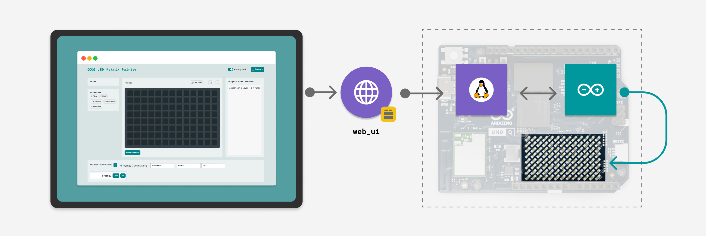

# LED Matrix Painter

The **LED Matrix Painter** example transforms your Arduino UNO Q into a design tool for the built-in LED Matrix. It features a web-based pixel editor that allows you to draw frames, create animations, and export the results as ready-to-use C++ code.



## Description

This App provides a complete workflow for designing LED matrix visuals. It uses the `web_ui` Brick to host a graphical editor where you can draw pixels with 8 levels of brightness. Changes are reflected instantly on the UNO Q's physical matrix.

The application uses the `dbstorage_sqlstore` Brick to persist your designs in a database, allowing you to save multiple frames, reorder them via drag-and-drop, and organize them into animations. Finally, the "Export .h" feature generates the exact C++ code needed to use your designs in standalone Arduino sketches.

Key features include:
- **Real-time Preview:** Drawing on the web interface updates the UNO Q matrix instantly.
- **8-bit Grayscale:** Support for 8 brightness levels per pixel (0-7 in the editor, mapped to 0-255).
- **Frame Management:** Create, delete, and reorder frames using a persistent database.
- **Transform Tools:** Quickly invert, rotate, or flip your designs.
- **Animation Mode:** Sequence frames to create and preview animations on the board.
- **Code Generation:** Export frames or animations as `uint32_t` arrays compatible with the `Arduino_LED_Matrix` library.

## Bricks Used

The LED Matrix Painter example uses the following Bricks:

- `web_ui`: Brick to create the interactive grid editor and manage API endpoints.
- `dbstorage_sqlstore`: Brick to persist frames and animation sequences using a SQLite database.

## Hardware and Software Requirements

### Hardware

- Arduino UNO Q (x1)
- USB-C® cable (for power and programming) (x1)

### Software

- Arduino App Lab

## How to Use the Example

1. **Run the App**
   Launch the App from Arduino App Lab.

2. **Access the Editor**
   Open the App in your browser at `<UNO-Q-IP-ADDRESS>:7000`.

3. **Draw Frames**
   - **Click** a cell in the grid to toggle it on.
   - **Click again** (or hover and wait) to open the brightness slider and adjust the intensity (0-7).
   - The design appears immediately on the UNO Q LED Matrix.

4. **Manage Your Session**
   - **Auto-save:** Changes are automatically saved to the database as you draw.
   - **Create:** Use the **+** button in the sidebar to create new empty frames.
   - **Reorder:** Drag and drop frames in the list to change their sequence.
   - **Transform:** Use the toolbar buttons to **Invert**, **Rotate 180°**, or **Flip** the current frame.

5. **Create Animations**
   - Switch the radio button in the sidebar to **Animations**.
   - Select multiple frames by clicking on them in the sidebar.
   - Click **Play Animation** to see the sequence run on the UNO Q.

6. **Export Code**
   - Click **Export .h** to download a C++ header file containing your designs.
   - Copy the generated code (displayed in the right column) directly into your Arduino sketch.

## How it Works

The LED Matrix Painter consists of three main components working together:

1.  **Web Interface**: An interactive grid editor that captures user input and sends pixel data to the backend.
2.  **Python Backend**: Manages the database, handles frame transformations, and communicates with the hardware.
3.  **Arduino Sketch**: Receives raw data and renders it on the physical matrix.

**High-level data flow:**

```
Web Browser  ──►  HTTP API  ──►  Python Backend  ──►  Router Bridge  ──►  Arduino Sketch
                                       │                                        │
                                       ▼                                        ▼
                                SQLite Database                          LED Matrix Display
```

## Understanding the Code

### 🔧 Backend (`main.py` & `store.py`)

The Python backend acts as the controller, managing the API and database interactions.

- **Persistence**: The application uses `SQLStore` to manage a `frames` table. This allows frames to be loaded, reordered, and updated efficiently.

```python
# store.py
db = SQLStore(database_name="led_matrix_frames")

def save_frame(frame: AppFrame) -> int:
    # Logic to calculate position and insert record
    record = frame.to_record()
    db.store("frames", record, create_table=False)
    # ...
```

- **Bridge Communication**: When a frame is loaded or edited, it is sent to the board. The `AppFrame` class handles the conversion of pixel data into the specific byte format required by the sketch.

```python
# main.py
def apply_frame_to_board(frame: AppFrame):
    """Send frame bytes to the Arduino board."""
    frame_bytes = frame.to_board_bytes()
    Bridge.call("draw", frame_bytes)
```

- **Code Export**: The `AppFrame` class includes logic to generate C++ source code strings (`uint32_t` arrays), which are returned to the frontend for display.

```python
# app_frame.py
def to_c_string(self) -> str:
    c_type = "uint32_t"
    parts = [f"const {c_type} {self.name}[] = {{"]
    # ... formats array data as hex/int ...
    parts.append("};")
    return "\n".join(parts)
```

### 🔧 Arduino Component (`sketch.ino`)

The sketch initializes the matrix and registers Bridge functions to receive data from Python.

- **Matrix Configuration**: The matrix is configured to accept 8-bit values, allowing for smooth gradients (0-255) rather than just on/off.

```cpp
void setup() {
  matrix.begin();
  // configure grayscale bits to 8 so the display can accept 0..255 brightness
  matrix.setGrayscaleBits(8);
  Bridge.begin();
  // ...
}
```

- **Drawing Frames**: The `draw` function receives a vector of bytes, which represents the frame data, and passes it to the matrix driver.

```cpp
void draw(std::vector<uint8_t> frame) {
  // Direct draw of received bytes
  matrix.draw(frame.data());
}
```

- **Playing Animations**: The `play_animation` function receives a stream of bytes representing multiple frames and durations. It reconstructs them into `uint32_t` arrays (the native format for the matrix library) and plays the sequence.

### 🔧 Frontend (`app.js`)

The JavaScript frontend handles the interactive grid logic.

- **Brightness Control**: It supports multi-level brightness by managing a dataset attribute `data-b` on each cell.
- **Auto-Persist**: To ensure a smooth user experience, changes are debounced and automatically sent to the backend via `schedulePersist()`, which updates both the database and the physical board simultaneously.

```javascript
// Unified persist: save to DB and update board together
function schedulePersist(){
  if (persistTimeout) clearTimeout(persistTimeout);
  persistTimeout = setTimeout(()=> {
    persistFrame();
    persistTimeout = null;
  }, AUTO_PERSIST_DELAY_MS);
}
```
