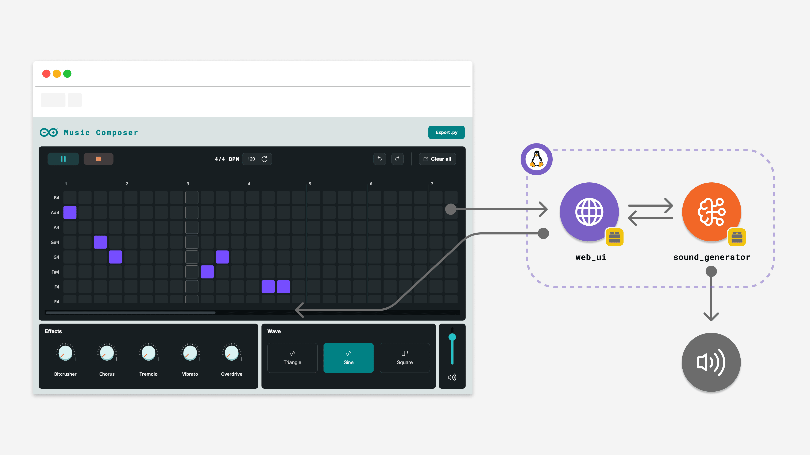

# Music Composer

The **Music Composer** example provides a web-based step sequencer interface to create polyphonic music patterns using a grid-based note editor. It features 18 notes spanning from F#3 to B4, adjustable BPM, multiple waveforms, and a comprehensive effects rack, all powered by the Arduino Sound Generator brick.



This App allows you to compose music by toggling notes on a grid where each row represents a note and each column represents a time step (sixteenth note). The grid dynamically expands as you add notes, supporting long compositions. Your creation can be played back in real-time with synchronized visual feedback, and you can export your composition as a Python file containing a `MusicComposition` object ready to be used in other Arduino App Lab projects.

**Key features include:**

- **Grid-based Step Sequencer:** 18-note polyphonic grid with automatic expansion.
- **Real-time Playback:** Visual step highlighting synchronized with audio playback.
- **Undo/Redo:** Full history tracking to easily revert or reapply changes.
- **Waveform Selection:** Choose from sine, square, and triangle waves.
- **Effects Rack:** Five knob-controlled effects (Bitcrusher, Chorus, Tremolo, Vibrato, Overdrive).
- **BPM Control:** Adjustable tempo(default 120 BPM).
- **Code Export:** Generate Python code with `MusicComposition` objects for reuse with `SoundGenerator` brick.

## Bricks Used

The Music Composer example uses the following Bricks:

- `web_ui`: Brick that provides the web interface and WebSocket channel for real-time control.
- `sound_generator`: Brick that handles audio synthesis, effects processing, and step sequencer playback.

## Hardware and Software Requirements

### Hardware

- Arduino UNO Q (x1)
- **USB speaker** (cabled)
- **USB-C® hub with external power** (x1) *(required if using USB audio device)*
- A power supply (5 V, 3 A) for the USB hub (x1) *(required if using USB audio device)*

### Software

- Arduino App Lab

**Note:** A **USB-C® hub is mandatory** if you want to use an external USB audio device. The UNO Q's single port must be used for the hub, which provides the necessary connections for both the power supply and the USB audio device. Consequently, when using external audio, this example must be run in **[Network Mode](learn/network-mode)** or **[SBC Mode](learn/single-board-computer)**.

## How to Use the Example

1. **Hardware Setup (Optional External Audio)**
   If you want to use an external USB audio device, connect it to a powered **USB-C® hub** attached to the UNO Q. Ensure the hub is powered.

2. **Run the App**
   Launch the App from Arduino App Lab. Wait until the App has launched completely.

3. **Access the Web Interface**
   Open the App in your browser at `<UNO-Q-IP-ADDRESS>:7000` (typically `192.168.x.x`).

4. **Create a Pattern**
   - **Toggle Notes:** Click cells in the grid to activate or deactivate notes. Active cells turn green.
   - **Notes:** Each row corresponds to a specific pitch (B4 at the top, F#3 at the bottom).
   - **Steps:** Each column represents a sixteenth note (1/16 beat).
   - **Grid Expansion:** The grid automatically expands by 16 steps when you add notes near the right edge.

5. **Adjust BPM**
   Use the BPM input field in the header to set the tempo (40-240 BPM). Click the **↻** button to reset to 120 BPM.

6. **Select a Waveform**
   Choose a waveform by clicking one of the wave buttons in the control panel:
   - **Sine:** Smooth, pure tone
   - **Square:** Classic synth sound, retro game style
   - **Triangle:** Mellower, softer than square

7. **Apply Effects**
   Adjust the five effect knobs by clicking and dragging vertically:
   - **Bitcrusher:** Lowers bit depth for lo-fi digital distortion.
   - **Chorus:** Adds depth and richness by simulating multiple voices.
   - **Tremolo:** Rhythmic amplitude modulation (volume vibrato).
   - **Vibrato:** Pitch modulation for expressive warble.
   - **Overdrive:** Adds harmonic distortion and saturation.

8. **Play Your Composition**
   Click the **▶ Play** button in the header. The current step will be highlighted with a cyan border as the sequence plays. Click **⏸ Pause** or **⏹ Stop** to control playback.

9. **Clear or Export**
   - **Clear:** Click the **✕** button to clear all notes.
   - **Export:** Click **Export .h** to download a Python file containing your composition as a `MusicComposition` object.

## How it Works

The application relies on a synchronized data flow between the web interface and the audio synthesis engine.

**High-level data flow:**

```
Web Browser Interaction  ──►  WebSocket  ──►  Python Backend
         ▲                                          │
         │                                          ▼
  (Visual Updates)                      (Build Sequence from Grid)
         │                                          │
         └─  WebSocket   ◄──   State    ◄──  SoundGenerator Brick
                                                    │
                                                    ▼
                                            Audio Output (USB)
```

- **User Interaction:** The frontend captures clicks on the grid and sends the updated grid state to the backend via WebSocket (`composer:update_grid`).
- **Sequence Building:** The Python backend converts the 2D grid (notes × steps) into a polyphonic sequence format: a list of steps, where each step contains a list of notes to play simultaneously.
- **Audio Playback:** The `SoundGenerator` brick's `play_step_sequence()` method plays the sequence, calling the `on_step_callback` for each step to synchronize visual feedback.
- **Step Highlighting:** The frontend runs a local timer to highlight the current step in sync with the backend-driven audio playback.

## Understanding the Code

### 🔧 Backend (`main.py`)

The Python script orchestrates the grid-to-audio conversion and manages the state.

- **Initialization:**
  - `gen = SoundGenerator(wave_form="sine", bpm=120, sound_effects=[SoundEffect.adsr()])`: Initializes the audio engine with a sine wave and ADSR envelope.
  - `NOTE_MAP`: A list of 18 note names from B4 down to F#3, corresponding to grid rows.

- **Grid State Management:**
  The grid state is stored as a nested dictionary: `{"noteIndex": {"stepIndex": bool}}`. For example, `grid["0"]["5"] = True` means the note B4 (row 0) is active on step 5.

- **Sequence Building:**
  The `build_sequence_from_grid()` function converts the grid dictionary into a list of steps:
  
  ```python
  sequence = [
      ["C4", "E4"],  # Step 0: play C4 and E4 together
      [],            # Step 1: rest (no notes)
      ["G4"],        # Step 2: play G4
      # ...
  ]
  ```

- **Event Handlers:**
  - `on_update_grid`: Receives the grid state from the frontend and broadcasts it to all clients.
  - `on_play`: Builds the sequence from the grid and calls `gen.play_step_sequence()` to start playback.
  - `on_stop`: Stops the sequence playback.
  - `on_set_bpm`, `on_set_waveform`, `on_set_volume`, `on_set_effects`: Update the audio parameters.
  - `on_export`: Generates a Python file containing the composition as a `MusicComposition` object.

- **Step Callback:**
  The `on_step_callback` is invoked by the `SoundGenerator` brick for each step. It sends a `composer:step_playing` event to the frontend for synchronization (though the frontend uses its own timer for smoother animation).

  ```python
  def on_step_callback(step: int, total_steps: int):
      current_step = step
      ui.send_message("composer:step_playing", {"step": step, "total_steps": total_steps})
  ```

### 🔧 Frontend (`app.js`)

The JavaScript frontend handles the UI logic, grid rendering, and playback visualization.

- **Grid Rendering:**
  The `buildGrid()` function dynamically creates the grid based on `totalSteps` (initially 16, expands by 16 when needed). Each cell has `data-note` and `data-step` attributes for easy lookup.

- **Toggle Cell:**
  Clicking a cell toggles its state in the local `grid` object and emits the updated grid to the backend:

  ```javascript
  function toggleCell(noteIndex, step) {
      const noteKey = String(noteIndex);
      const stepKey = String(step);
      if (!grid[noteKey]) grid[noteKey] = {};
      const newValue = !(grid[noteKey][stepKey] === true);
      grid[noteKey][stepKey] = newValue;
      renderGrid();
      socket.emit('composer:update_grid', { grid });
  }
  ```

- **Playback Animation:**
  When the **Play** button is clicked, the frontend starts a local interval timer that highlights the current step at the rate determined by BPM:

  ```javascript
  function startLocalPlayback() {
      const stepDurationMs = (60000 / bpm) / 4; // Sixteenth notes: 4 per beat
      playInterval = setInterval(() => {
          currentStep++;
          if (currentStep >= effectiveLength) {
              stopLocalPlayback();
              return;
          }
          highlightStep(currentStep);
      }, stepDurationMs);
  }
  ```

  This ensures smooth visual feedback even if network latency varies.

- **Effects Knobs:**
  The knobs use mouse drag to adjust values (0-100). Dragging up increases the value, dragging down decreases it. On `mouseup`, the new effects state is sent to the backend.

- **Auto-scroll:**
  The sequencer container auto-scrolls horizontally to keep the currently playing step visible in the center of the viewport.

### 🔧 Sequence Export

The `on_export` handler generates Python code that defines a `MusicComposition` object. This object can be loaded and played in other Arduino App Lab projects using `gen.play_composition(composition)`.

**Example exported code:**

```python
from arduino.app_bricks.sound_generator import SoundGenerator, MusicComposition, SoundEffect

# Define the composition (each inner list is a step with notes to play simultaneously)
composition_tracks = [
    [("B4", 1/16)],                    # Step 0: single note
    [("A#4", 1/16), ("D4", 1/16)],    # Step 1: chord (two notes together)
    [],                                 # Step 2: REST (empty list)
    [("G#4", 1/16)],                   # Step 3: single note
    # ...
]

composition = MusicComposition(
    composition=composition_tracks,
    bpm=120,
    waveform="sine",
    volume=0.80,
    effects=[
        SoundEffect.adsr(),
        SoundEffect.chorus(depth_ms=10, rate_hz=0.25, mix=0.40)
    ]
)

# Play the composition
gen = SoundGenerator()
gen.start()
gen.play_composition(composition, block=True)
```

## Troubleshooting

### "No USB speaker found" error (when using external audio)
If the application fails to start and you see an error regarding the speaker:
**Fix:**
1. Ensure a **powered USB-C® hub** is connected to the UNO Q.
2. Verify the **USB audio device** is connected to the hub and turned on.
3. Restart the application.

### No Sound Output
If the interface works but there is no sound:
- **Volume Control:** Check the volume slider in the UI (right side of control panel).
- **System Volume:** Ensure your speaker or system volume is not muted.
- **Grid Empty:** Ensure you have toggled at least one note cell (it should be green).
- **Audio Device:** Remember that **HDMI audio** and **Bluetooth® speakers** are not supported.

### Choppy or Crackling Audio
- **CPU Load:** Close other applications running on the Arduino UNO Q.
- **Power Supply:** Ensure you are using a stable 5 V, 3 A power supply for the USB-C® hub. Insufficient power often degrades USB audio performance.

### Grid Not Expanding
- The grid expands automatically when you click a note within 8 steps of the right edge. Ensure you are clicking far enough to the right.

### Playback Not Highlighting Correctly
- The frontend uses a local timer to highlight steps. If the BPM changes during playback, stop and restart playback to sync the timer.

## Technical Details

- **Grid Size:** 18 notes (F#3 to B4) × dynamic steps (initially 16, expands by 16)
- **Note Duration:** Sixteenth notes (1/16 beat)
- **BPM Range:** 40-240 BPM (default: 120)
- **Waveforms:** Sine, Square, Triangle
- **Effects:** Bitcrusher, Chorus, Tremolo, Vibrato, Overdrive
- **Export Format:** Python file with `MusicComposition` object (step-based format)
- **Audio Output:** USB audio device
