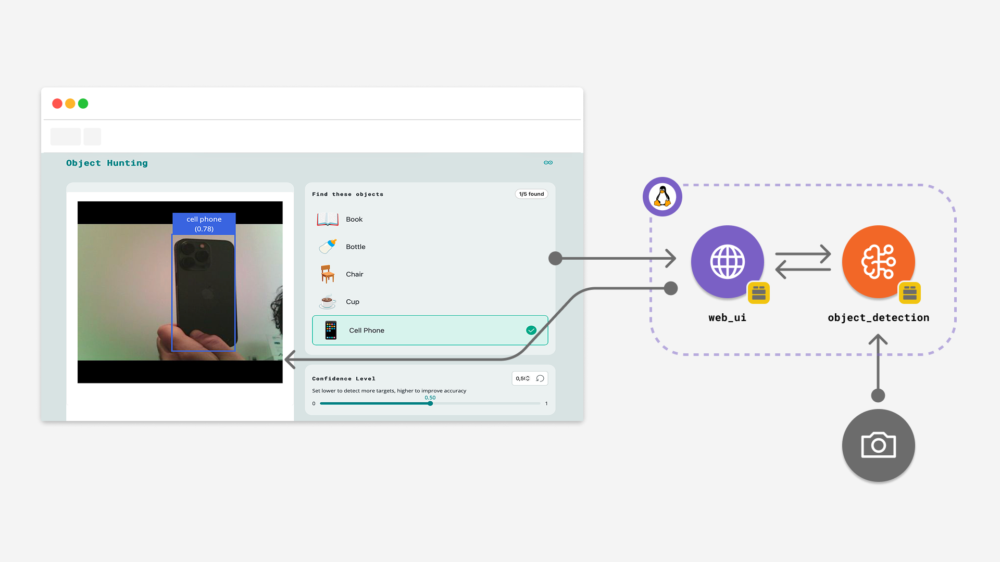

# Object Hunting

The **Object Hunting** is an interactive scavenger hunt that uses real-time object detection. Players must locate specific physical objects in their environment using a USB camera connected to the Arduino UNO Q to win the game.



## Description

This App creates an interactive game that recognizes real-world objects. It utilizes the `video_objectdetection` Brick to stream video from a USB webcam and perform continuous inference. The web interface challenges the user to find five specific items: **Book, Bottle, Chair, Cup, and Cell Phone**.

Key features include:

- Real-time video streaming and object recognition
- Interactive checklist that updates automatically when items are found
- Confidence threshold adjustment to tune detection sensitivity
- "Win" state triggering upon locating all target objects

## Bricks Used

The object hunting game example uses the following Bricks:

- `web_ui`: Brick to create the interactive game interface and handle WebSocket communication.
- `video_objectdetection`: Brick that manages the USB camera stream, runs the machine learning model, and provides real-time detection results.

## Hardware and Software Requirements

### Hardware

- Arduino UNO Q (x1)
- **USB-C® hub with external power (x1)**
- A power supply (5 V, 3 A) for the USB hub (x1)
- **USB Webcam** (x1)

### Software

- Arduino App Lab

**Important:** A **USB-C® hub is mandatory** for this example to connect the USB Webcam. Consequently, this example must be run in **[Network Mode](learn/network-mode)** or **[SBC Mode](learn/single-board-computer)**.

**Note:** You must connect the USB camera **before** running the App. If the camera is not connected or not detected, the App will fail to start.

## How to Use the Example

1. **Hardware Setup**
   Connect your **USB Webcam** to a powered **USB-C® hub** attached to the UNO Q. Ensure the hub is powered to support the camera.

2. **Run the App**
   Launch the App from Arduino App Lab.
   *Note: If the App stops immediately after clicking Run, check your USB camera connection.*

3. **Access the Web Interface**
   Open the App in your browser at `<UNO-Q-IP-ADDRESS>:7000`. The interface will load, showing the game introduction and the video feed placeholder.

4. **Start the Game**
   Click the **Start Game** button. The interface will switch to the gameplay view, displaying the live video feed and the list of objects to find.

5. **Hunt for Objects**
   Point the camera at the required items (Book, Bottle, Chair, Cup, Cell Phone). When the system detects an object with sufficient confidence, it will automatically mark it as "Found" in the UI.

6. **Adjust Sensitivity**
   If the camera is not detecting objects easily, or is detecting them incorrectly, use the **Confidence Level** slider on the right.
   - **Lower value:** Detects objects more easily but may produce false positives.
   - **Higher value:** Requires a clearer view of the object to trigger a match.

7. **Win the Game**
   Once all five objects are checked off the list, a "You found them all!" screen appears. You can click **Play Again** to reset the list and restart.

## How it Works

Once the App is running, it performs the following operations:

- **Video Streaming**: The `video_objectdetection` Brick captures video from the USB camera and hosts a low-latency stream on port `4912`. The frontend embeds this stream via an `<iframe>`.
- **Inference**: The backend continuously runs an object detection model on the video frames.
- **Event Handling**: When objects are detected, the backend sends the labels to the frontend via WebSockets.
- **Game Logic**: The frontend JavaScript compares the received labels against the target list (`['book', 'bottle', 'chair', 'cup', 'cell phone']`) and updates the game state.

## Understanding the Code

### 🔧 Backend 

The Python® script initializes the detection engine and bridges the communication between the computer vision model and the web UI.

- **Initialization**: Sets up the WebUI and the Video Object Detection engine.
- **Threshold Control**: Listens for `override_th` messages from the UI to adjust how strict the model is when identifying objects.

```python
ui = WebUI()
detection_stream = VideoObjectDetection()

# Allow the slider in the UI to change detection sensitivity
ui.on_message("override_th", lambda sid, threshold: detection_stream.override_threshold(threshold))
```

- **Reporting Detections**: The script registers a callback using `on_detect_all`. Whenever the model identifies objects, this function iterates through them and sends the labels to the frontend.

```python
def send_detections_to_ui(detections: dict):
  for key, value in detections.items():
    entry = {
      "content": key,
      "timestamp": datetime.now(UTC).isoformat()
    }
    ui.send_message("detection", message=entry)

detection_stream.on_detect_all(send_detections_to_ui)
```

### 🔧 Frontend 

The web interface handles the game logic, video embedding, and user feedback.

- **Video Embedding**: The HTML loads the raw video stream provided by the backend on a specific port.

```javascript
const targetPort = 4912;
const streamUrl = `http://${currentHostname}:${targetPort}/embed`;
```

- **Game State Management**: The JavaScript defines the targets and tracks progress.

```javascript
const targetObjects = ['book', 'bottle', 'chair', 'cup', 'cell phone'];
let foundObjects = [];
```

- **Processing Detections**: When the backend sends a `detection` event, the script checks if the detected object is in the target list and hasn't been found yet. If it matches, it updates the UI and checks for a win condition.

```javascript
function handleDetection(detection) {
    const detectedObject = detection.content.toLowerCase();
    
    // Check if the detected item is a target and not yet found
    if (targetObjects.includes(detectedObject) && !foundObjects.includes(detectedObject)) {
        foundObjects.push(detectedObject);
        
        // Update UI to show item as found
        const foundItem = document.getElementById(`obj-${detectedObject}`);
        foundItem.classList.add('found');
        
        updateFoundCounter();
        checkWinCondition();
    }
}
```

- **Win Condition**:

```javascript
function checkWinCondition() {
    if (foundObjects.length === targetObjects.length) {
        gameStarted = false;
        // Hide video, show win screen
        videoFeedContainer.classList.add('hidden');
        winScreen.classList.remove('hidden');
    }
}
```