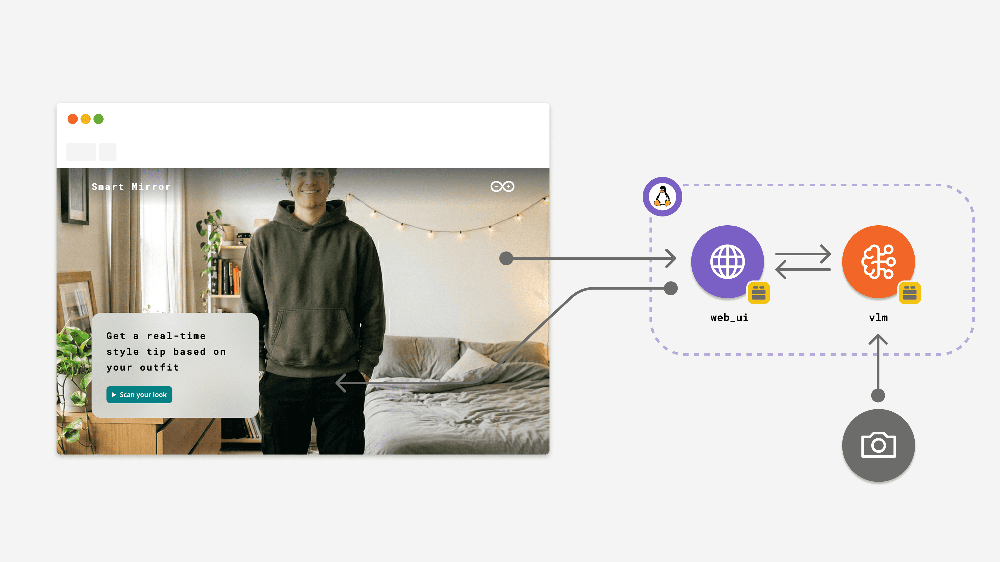

# Smart Mirror

The **Smart Mirror** example turns your Arduino® Ventuno™ Q into an AI-powered style advisor. Point a USB camera at yourself, tap "Scan your look", and get a real-time outfit description with a personalized styling tip — all powered by a Vision Language Model running locally on the board.



**Note:** This example requires Network Mode and a USB camera connected to the board.

## Description

Smart Mirror uses the `vlm` Brick to analyze a live camera feed and deliver instant fashion advice. When the user taps the scan button, the app captures a single frame from the camera, sends it to a local Vision Language Model along with a carefully crafted prompt, and displays the AI-generated response in a mirror-style overlay on top of the video feed.

The AI identifies the most prominent clothing item in view, detects its color, and returns exactly two sentences: one describing what you are wearing and one styling tip. The prompt is randomized with different openers and tip starters to keep responses feeling fresh.

**Key features include:**

- **Live camera preview** — a real-time MJPEG video stream displayed as a full-screen mirror background.
- **One-tap scan** — a four-second countdown gives you time to pose before the AI analyzes your outfit.
- **On-device AI** — the VLM runs inside a Docker container on the board, so no cloud connection is required for inference.
- **Responsive UI** — the interface adapts from mobile to desktop layouts with a frosted-glass overlay panel.

## Bricks Used

The Smart Mirror example uses the following Bricks:

- `vlm`: Provides the `VisionLanguageModel` class to send camera frames and text prompts to a locally hosted Vision Language Model and receive style advice.
- `web_ui`: Provides the `WebUI` class to serve the frontend, handle WebSocket communication, and expose a custom video streaming API endpoint.

## Hardware and Software Requirements

### Hardware

- Arduino Ventuno Q (x1)
- USB-C® cable (for power) (x1)
- USB camera (x1)

### Software

- Arduino App Lab

**Note:** You can also run this example using your Arduino Ventuno Q as a Single Board Computer (SBC) using a [USB-C® hub](https://store.arduino.cc/products/usb-c-to-hdmi-multiport-adapter-with-ethernet-and-usb-hub) with a mouse, keyboard and display attached.

## How to Use the Example

1. **Connect a USB camera to the board.** Plug the camera into one of the available USB ports on the Ventuno Q.

2. **Run the app from Arduino App Lab.** Deploy and start the Smart Mirror example. The backend initializes the camera, the VLM model, and the web server.

3. **Open the web interface.** Navigate to `<board-name>.local:7000` in your browser. You should see a live camera feed filling the screen with an overlay panel at the bottom.

4. **Scan your outfit.** Tap the **Scan your look** button. A four-second countdown begins — step into view and strike a pose.

5. **Read your style tip.** After the countdown, the AI analyzes the captured frame. The panel displays "The mirror says:" followed by a two-sentence response: what you are wearing and a styling suggestion.

6. **Scan again.** Tap **Scan again** to get a new analysis. Each scan uses a different random opener for variety.

## How it Works

Once the application is running, the device performs the following operations:

```
┌────────────┐     ┌─────────────┐     ┌──────────────┐     ┌──────────────────┐
│ USB Camera │────▶│  Python     │────▶│  VLM Brick   │────▶│ Local VLM Service│
│ (30 fps)   │     │  Backend    │     │ (LangChain)  │     │ (Docker/qwen3-vl)│
└────────────┘     └──┬──────┬──┘     └──────────────┘     └──────────────────┘
                      │      │
              MJPEG   │      │ WebSocket
              stream  │      │ (analysis_result)
                      ▼      ▼
               ┌──────────────────┐
               │   Browser UI     │
               │ (mirror overlay) │
               └──────────────────┘
```

1. **Camera capture loop** — the `Camera` peripheral captures JPEG frames at 30 fps. Each frame is stored in a thread-safe buffer (`frame_lock`).
2. **Video streaming** — the backend exposes a `/stream` endpoint that serves an MJPEG stream. The browser displays this as a full-screen background image.
3. **Scan trigger** — when the user taps "Scan your look", the frontend sends a `start_scan` WebSocket event after a four-second countdown.
4. **AI analysis** — the backend grabs the latest frame and calls `vlm.chat()` using the predefined system prompt and a randomized user prompt generated from the user prompt template in `prompt.yaml`. The VLM identifies the most prominent clothing item, its color, and generates a two-sentence response.
5. **Result delivery** — the response is sent back to the requesting client via a `analysis_result` WebSocket event and displayed in the overlay panel.

## Understanding the Code

Here is a brief explanation of the App components:

### 🔧 Backend (`main.py` & `prompt.py`)

- **VLM initialization**: The `VisionLanguageModel` is created with a system prompt from `prompt.yaml`, a lower temperature (0.4) for consistent output, and a 120-token limit to keep responses concise.

  ```python
  vlm = VisionLanguageModel(
      system_prompt=SYSTEM_PROMPT,
      temperature=0.4,
      max_tokens=120,
  )
  ```

- **Camera capture loop**: Runs continuously via `App.run(user_loop=loop)`, capturing frames at 30 fps and storing them in a thread-safe global buffer.

  ```python
  camera = Camera(fps=30, adjustments=compressed_to_jpeg())

  def loop():
      global current_frame
      frame = camera.capture()
      if frame is None:
          return
      with frame_lock:
          current_frame = frame.tobytes()
  ```

- **Scan handler (`scan_look`)**: Grabs the current frame, sends it to the VLM with a randomized prompt, and returns the result to the requesting client via WebSocket.

  ```python
  def scan_look(sid, _data):
      with frame_lock:
          frame = current_frame
      result = vlm.chat(
          message=prompt.build_user_prompt(USER_PROMPT_TEMPLATE),
          images=[frame],
      ).strip()
      ui.send_message("analysis_result", result, room=sid)
  ```

- **Prompt design (`prompt.py` + `prompt.yaml`)**: The system prompt instructs the VLM to act as a "Smart Mirror Stylist" that returns exactly two sentences. The user prompt template injects randomized openers (e.g., "You're rocking", "I see you've chosen") and tip starters (e.g., "Try", "For a cleaner look") for variety.

- **Video stream endpoint**: A FastAPI `StreamingResponse` serves an MJPEG stream at `/stream`, enabling real-time video in the browser without WebRTC.

  ```python
  ui.expose_api("GET", "/stream", video_stream)
  ```

### 💻 Frontend (`index.html`, `app.js` & `function.js`)

- **Live video feed**: The browser loads the MJPEG stream from `http://<hostname>:7000/stream` as an `` element that fills the entire viewport, creating the mirror effect.

- **WebSocket connection (`app.js`)**: Connects to the backend via Socket.IO. On `connect`, the UI resets to its initial state and loads the webcam stream. On `disconnect`, an error message is shown.

- **Scan flow (`function.js`)**: The scan follows a state machine with four states:
  - **`initial`** — shows "Scan your look" button.
  - **`preparing`** — four-second countdown with a "Cancel scan" option.
  - **`analysing`** — rotating status phrases ("I am capturing your look", "I am reading your colors", etc.) while waiting for the VLM response.
  - **`result`** — displays "The mirror says:" with the AI response and a "Scan again" button.

- **Minimum scan duration**: A three-second minimum ensures the scanning animation is visible even if the VLM responds quickly, giving the user time to perceive the analysis process.

## Troubleshooting

### Camera not detected

**Fix:** Verify the USB camera is connected and recognized by the board. Disconnect and reconnect the camera, then restart the app.

### "Connection to the board lost" message

**Fix:** Check that the board is powered and connected to the same network. Refresh the browser page to re-establish the WebSocket connection.

### VLM response is empty or generic

**Fix:** Ensure you are standing clearly in frame with visible clothing. The model works best with a single person in view and good lighting. If responses remain empty, verify the VLM model (`genie:qwen3-vl-4b`) is downloaded and running.
