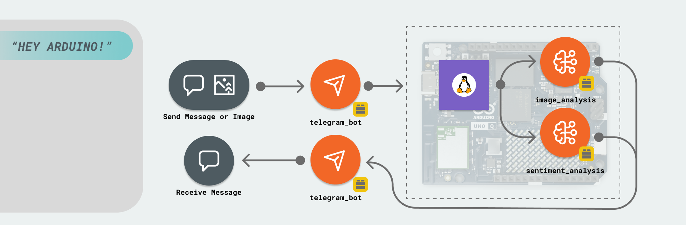
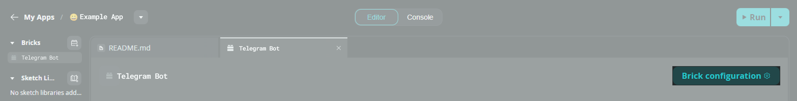

# Telegram Bot

The **Telegram Bot** example demonstrates how to create an interactive bot that responds to commands, analyzes text sentiment, and detects objects in images sent via Telegram.

## Description

This example transforms your Arduino UNO Q into a Telegram bot that can:

- Respond to commands like `/hello` and `/help`
- Analyze the sentiment (mood) of text messages
- Detect objects in photos you send to the bot

The Python® script handles all the bot logic and AI processing using specialized Bricks. The bot communicates with Telegram's servers to receive messages and send responses.



## Bricks Used

The Telegram Bot example uses the following Bricks:

- `telegram_bot`: Handles communication with the Telegram Bot API for sending/receiving messages and photos
- `object_detection`: Performs AI-powered object detection on images
- `mood_detector`: Analyzes sentiment and mood from text messages

## Hardware and Software Requirements

### Hardware

- Arduino UNO Q (x1)
- USB-C® cable (for power and programming) (x1)

### Software

- Arduino App Lab
- A Telegram account

**Note:** This example requires an active internet connection to communicate with Telegram's servers and AI services.

## How to Use the Example

### Create a Telegram Bot

To use this example, you need to create a bot on Telegram:

1. Open Telegram and search for [@BotFather](https://t.me/BotFather)
2. Send the message `/newbot`
3. Follow BotFather's instructions to:
   - Choose a name for your bot
   - Choose a unique username (must end with "bot")
4. BotFather will provide you with an **API token** that looks like: `123456789:AA...your-token-here...`
5. **Save this token securely** - you'll need it to configure the App

### Configure the Application

1. **Duplicate the Example**
   Since built-in examples are read-only, duplicate this App to edit the configuration. Click the arrow next to the App name and select **Duplicate** or click the **Copy and edit app** button.

2. **Configure the Bot Token**
   On the App page, locate the **Bricks** section on the left. Click on the **Telegram Bot** Brick, then click the **Brick Configuration** button.

   

   In the configuration panel, enter your API token from BotFather into the token field.

### Run the App

1. Click the **Run** button in the top right corner
2. Wait for the App to start (you should see confirmation in the logs)

### Interact with Your Bot

1. In Telegram, search for your bot using the username you created
2. Start a chat with the bot by clicking **Start** or sending `/start`
3. Try these interactions:
   - Send `/hello` for a greeting
   - Send `/help` for available commands
   - Send any text message to get mood analysis
   - Send a photo to detect objects

## How it Works

Once the application is running, it performs the following operations:

- **Bot Registration**: The App registers command handlers and message handlers with the Telegram Bot API
- **Message Processing**: When users send messages, the appropriate handler processes them:
  - Commands trigger specific responses
  - Text messages are analyzed for sentiment
  - Photos are processed for object detection
- **AI Integration**: The App uses the `mood_detector` and `object_detection` bricks to analyze content
- **Response Sending**: Results are sent back to the user via Telegram

The high-level data flow looks like this:

```
Telegram User → Bot API → Python Handlers → AI Bricks → Response → User
```

## Understanding the Code

Here is a brief explanation of the application components:

### 🔧 Backend (`main.py`)

The Python® script manages bot interactions and AI processing.

- **Import statements**: Load the necessary Bricks and utilities
- **Brick initialization**: Create instances of TelegramBot, ObjectDetection, and MoodDetector
- **Command handlers**: Functions that respond to specific commands like `/hello` and `/help`
- **Message handlers**: Functions that process text messages and photos
- **Handler registration**: Connect handlers to the bot using `add_command()`, `on_text()`, and `on_photo()`

Key code sections:

```python
# Initialize bricks
bot = TelegramBot()
obj_detection = ObjectDetection()
mood = MoodDetector()

def greet(sender: Sender, message: Message):
    """Handle /hello command"""
    sender.reply(f"👋 Hi {sender.first_name}! This is Arduino UNO Q!")

def sentiment(sender: Sender, message: Message):
    """Analyze mood from text"""
    result = mood.get_sentiment(message.text)
    sender.reply(f"Your mood is: {result}")

def detect_objects(sender: Sender, message: Message, photo: bytes, filename: str, size: int):
    """Detect objects in photos"""
    # Process image and detect objects
    image = Image.open(BytesIO(photo))
    results = obj_detection.detect(image, confidence=0.1)

    # Draw bounding boxes and send result
    img_with_boxes = obj_detection.draw_bounding_boxes(image, results)
    # ... send processed image back
```

The `sender.reply()` method makes it easy to send responses, while `sender.reply_photo()` handles image responses with captions.
