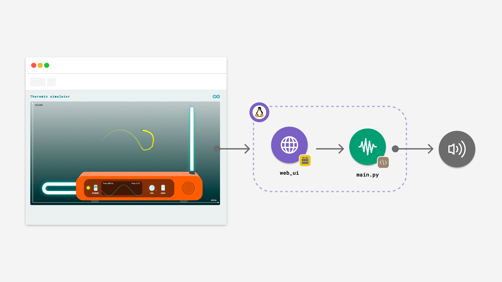

# Theremin Simulator

The **Theremin Simulator** example lets you create and control a virtual theremin instrument using an interactive web interface, producing synthesized audio output through a connected **USB** audio device with low latency.

> **Note**: This example must be run in **[Network Mode](learn/network-mode)** or **[SBC Mode](learn/single-board-computer)**, since it requires a **USB-C® hub** and a **USB speaker**.



This example generates real-time audio by creating sine waves at varying frequencies and amplitudes based on user input from the web interface. The workflow involves receiving mouse/touch coordinates from the frontend and updating a **Wave Generator** Brick, which handles the audio synthesis, smoothing, and streaming to the USB device automatically.

## Bricks Used

- `web_ui`: Brick that provides the web interface and a WebSocket channel for real-time control of the theremin.
- `wave_generator`: Brick that handles audio synthesis, envelope control (smoothing), and streaming to the USB audio device.

## Hardware and Software Requirements

### Hardware

- [Arduino UNO Q](https://store.arduino.cc/products/uno-q) (x1)
- **USB-C® hub with external power (x1)**
- A power supply (5 V, 3 A) for the USB hub (x1)
- A **USB audio device** (choose one):
  - **USB speaker** (cabled) ✅ *supported*
  - **USB wireless speaker receiver/dongle** (2.4 GHz, non-Bluetooth) ✅ *supported*
  - **USB‑C → 3.5 mm audio connector** + headphones/speakers ⚠️ *not tested* (may work)
- A **power supply** (5 V, 3 A) for the USB hub (e.g. a phone charger)

> **Not supported:** **HDMI audio** and **Bluetooth® Speakers** are not supported by this App.

### Software

- Arduino App Lab

**Note:** A **USB-C® hub is mandatory** for this example. The UNO Q's single port must be used for the hub, which provides the necessary connections for both the power supply and the USB audio device. consequently, this example must be run in **[Network Mode](learn/network-mode)** or **[SBC Mode](learn/single-board-computer)**.

## How to Use the Example

1. **Hardware Setup:** Connect your **USB audio device** (e.g., USB speaker, wireless USB receiver) to a powered **USB-C® hub** attached to the UNO Q.
   

2. **Launch:** Launch the App by clicking the **Play** button in the top-right corner. Wait until the App has launched.
   

3. **Open Interface:** Open the App in your browser at `<UNO-Q-IP-ADDRESS>:7000` *(typically 192.168.x.x, e.g., http://192.168.1.11:7000)*.

### Interacting with the Interface

Once the web page loads, follow these steps to make sound:

1.  **Turn on Power:** Locate the orange control panel at the bottom. Click the **POWER** switch to toggle it **ON** (the small LED indicator will light up).
    *   *Note: No sound will be produced if this switch is OFF.*
2.  **Set Master Volume:** Adjust the **VOL** knob to a comfortable level (e.g., 70-80%). This sets the maximum output limit for the application.
3.  **Play the Instrument:** Drag your mouse (or use your finger on a touchscreen) inside the large gray background area:
    *   **Horizontal (Left ↔ Right):** Controls **Pitch**. Moving right increases the frequency (higher notes).
    *   **Vertical (Bottom ↕ Top):** Controls **Note Volume**. Moving up increases the amplitude (louder). Moving to the very bottom silences the note.
4.  **Waveform Display:** The screen in the center of the panel visualizes the real-time sine wave, frequency (Hz), and amplitude data.

#### Additional Controls
*   **GRID Switch:** Toggles a background grid overlay. Use this to visually reference specific pitch intervals or volume levels.

## How it Works

The application uses the `wave_generator` Brick to create a continuous audio stream. The Python backend receives user coordinates via WebSocket and updates the generator's frequency and amplitude. The Brick automatically handles **envelope smoothing** (attack, release, glide) to ensure the audio changes sound natural and analog-like, rather than robotic.

- **User Interaction**: The frontend captures mouse/touch coordinates and sends them to the backend.
- **Real-time Communication**: Input data is sent via the `web_ui` Brick's WebSocket channel.
- **Audio Synthesis**: The `wave_generator` Brick runs in the background. It takes the target frequency and amplitude and applies a **glide algorithm** to transition smoothly between notes.
- **Audio Output**: The Brick streams the generated sine wave directly to the **USB** audio device.

**High-level data flow:**
```
Web Browser Interaction  ──►  WebSocket  ──►  Python Backend
         ▲                                          │
         │                                          ▼
  (Visual Updates)                         (Glide & Synthesis)
         │                                          │
         └─  WebSocket   ◄──   State    ◄──  Sine Wave Generation
                                                    │
                                                    ▼
                                             USB Audio Output
```


## Understanding the Code

### 🔧 Backend (`main.py`)

The Python code is simplified by using the `WaveGenerator` Brick, which encapsulates the audio logic.

- `wave_gen = WaveGenerator(...)` – Initializes the audio engine. It configures the **wave type** (sine), **sample rate** (16kHz), and **envelope parameters** (attack, release, glide). This Brick automatically connects to the USB audio device and starts a background thread for streaming.
- `ui.on_message('theremin:move', on_move)` – When the frontend sends new coordinates, this function calculates the target frequency and calls `wave_gen.set_frequency()` and `wave_gen.set_amplitude()`.
- `App.run()` – Starts the application. Since the audio generation is handled by the Brick in the background, no custom loop is required here.

### 💻 Frontend (`main.js`)

The web interface provides the interactive play area and controls for the user.

- **Socket.IO connection** to the backend to send and receive data in real time.
- **Event listeners** capture `mousedown`, `mousemove`, `mouseup` (and touch equivalents) to track user interaction in the play area.
- `socket.emit('theremin:move', { x, y })` – Sends normalized (0.0–1.0) X and Y coordinates to the backend; emissions are **throttled to ~80 Hz (≈12 ms)** to avoid overload.
- `socket.on('theremin:state', ...)` – Receives state updates from the backend (like the calculated frequency and amplitude) and updates the values displayed on the webpage.
- **Visual Waveform Generation:** Using the amplitude and frequency data received from the backend, the frontend draws a real-time sine wave animation on the HTML Canvas, providing immediate visual feedback.
- `socket.emit('theremin:set_volume', { volume })` – Sends a **0–100** master volume value.
- `socket.emit('theremin:power', { on })` – Toggles synth power (**On/Off**).

## Troubleshooting

### "No USB speaker found" error

If the application fails to start and you see an error regarding the speaker (e.g., inside the `WaveGenerator` initialization), it means the required audio hardware is missing.

**Fix:**
1. Make sure a **powered USB-C® hub** is connected to the UNO Q and its **5 V / 3 A** power supply is plugged in.
2. Verify the **USB audio device** (USB speaker or wireless USB receiver) is **connected to the hub** and, if it has a switch, **turned on**.
3. Restart the application.

### No Sound Output

- **Power Button:** Make sure the button in the web UI shows **On**.
- **Volume Knob:** Check the visual knob on the web UI.
- **Pointer Position:** Move your mouse/finger toward the top of the play area (the bottom corresponds to zero volume).
- **Speaker/Headphone Volume:** Check the physical volume control and mute status on your speaker or headphones.
- **Output Path:** Remember that **HDMI audio** and **Bluetooth® speakers** are not supported; use a **USB** audio device.

### Choppy or Crackling Audio

- **CPU Load:** Close any other applications running on the Arduino UNO Q that may be consuming significant resources.
- **Power Supply:** Ensure you are using a stable, adequate power supply (5 V, 3 A) for the USB-C® hub, as insufficient power can affect USB peripheral performance.

## Technical Details

- **Sample rate:** 16,000 Hz
- **Audio format:** 32-bit float, little-endian
- **Block duration:** ~30 ms
- **Frequency range:** ~20 Hz to ~8,000 Hz
- **Envelope:**
  - **Attack:** 0.01s (fast onset)
  - **Release:** 0.03s (quick fade out)
  - **Glide:** 0.02s (smooth pitch sliding)

## Compatibility Notes

- **Works with:**
  - **USB speakers** (cabled)
  - **USB wireless speaker receivers** (2.4 GHz dongles)
- **Untested (may work):**
  - **USB‑C → 3.5 mm audio dongles** feeding analog speakers/headphones
- **Not supported:**
  - **HDMI audio** output
  - **Bluetooth® speakers**

## License

This example is licensed under the Mozilla Public License 2.0 (MPL-2.0).

Copyright (C) 2025 ARDUINO SA <http://www.arduino.cc>