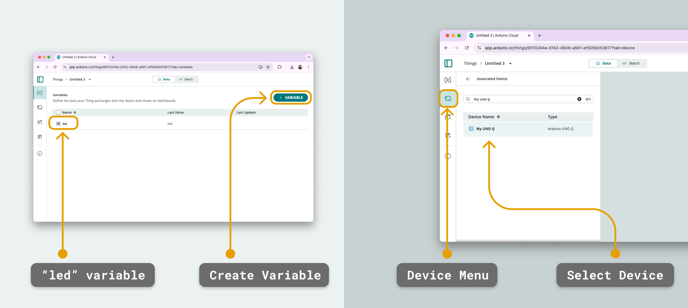
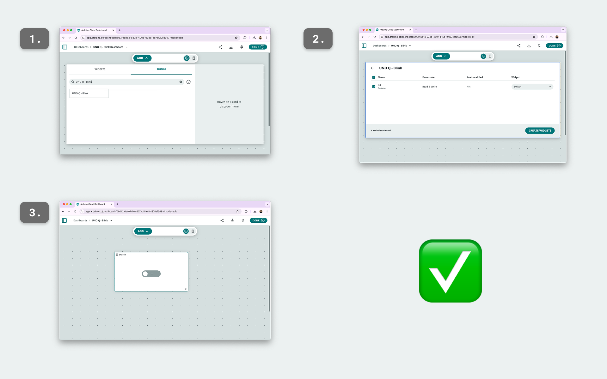
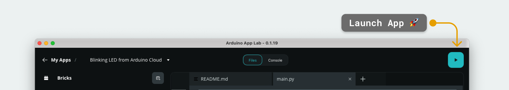
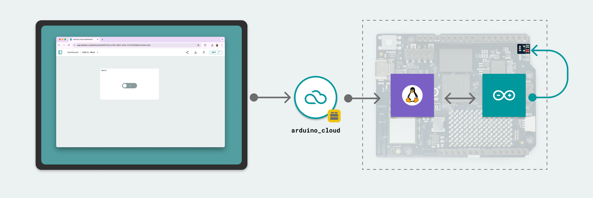

# Blinking LED from Arduino Cloud

This **Blinking LED from Arduino Cloud** example allows us to remotely control the onboard LED on the board from the [Arduino Cloud](https://app.arduino.cc/).

The LED is controlled by creating a dashboard with a switch in the Arduino Cloud.

## Bricks Used

The Blinking LED from Arduino Cloud example uses the following Bricks:

- `arduino_cloud`: Brick to create a connection to the Arduino Cloud

## Hardware and Software Requirements

### Hardware

- Arduino® UNO Q or Arduino VENTUNO Q
- [USB-C® cable](https://store.arduino.cc/products/usb-cable2in1-type-c)

### Software

- Arduino App Lab
- [Arduino Cloud](https://app.arduino.cc/)

**Note:** You can run this example using your board as a Single Board Computer (SBC) using a [USB-C® hub](https://store.arduino.cc/products/usb-c-to-hdmi-multiport-adapter-with-ethernet-and-usb-hub) with a mouse, keyboard and display attached.

## How to Use the Example

This example requires an active Arduino Cloud account, with the board connected to the Cloud, and a thing and dashboard set up.

### Connecting the Board to Arduino Cloud

The board is registered with Arduino Cloud directly from Arduino App Lab, no credentials need to be copied or configured manually.

1. In Arduino App Lab, go to **Settings** and find the **Arduino Cloud** section, then click on **"Connect device"**. Sign in with your Arduino account if requested, select the Cloud space where you want to add the board, and click on **"Connect device"**. Wait until the status shows **"Connected"**.

**Note:** If you skip this step, launching the App will show a **"Provisioning required"** dialog: clicking on **"Connect device"** brings you to the same setup flow.

### Setting Up Arduino Cloud

1. Navigate to the [Arduino Cloud](https://app.arduino.cc/) page and log in with the same account used in Arduino App Lab.

2. Go to the [things](https://app.arduino.cc/things) page and create a new thing.

3. Inside the thing, create a new **boolean** variable, and name it **"led"**. We also need to associate the board we connected with this thing: it appears in the device list with its board name.

    

4. Finally, navigate to the [dashboards](https://app.arduino.cc/dashboards), and create a dashboard. Inside the dashboard, click on **"Edit"**, and select the **Thing** tab, and select the Thing we just created. This will automatically assign a switch widget to the **led** variable.

    

### Launch the App

1. Launch the App by clicking on the "Play" button in the top right corner. Wait until the App has launched.

    

## How it Works

The application works by establishing a connection between the Arduino Cloud and the UNO Q board. When interacting with the dashboard's switch widget (turn ON/OFF), the cloud updates the "led" property. 

The `main.py` script running on the Linux system listens for changes to this property using the `arduino_cloud` Brick. When a change is detected, the **Bridge** tool is used to send data to the microcontroller, and turn the LED ON.

The flow of the App is:

1. The switch in the Arduino Cloud dashboard is changed.

2. The Arduino Cloud updates the device's state.

3. `main.py` receives the updated state, sends a message to the microcontroller which turns the LED to an ON/OFF state.



### Understanding the Code

On the Linux (Python®) side:

- `iot_cloud = ArduinoCloud()` - initializes the `ArduinoCloud` class.
- `iot_cloud.register("led", value=False, on_write=led_callback)` - creates a callback function that fires when the value in the Arduino Cloud changes.
- `Bridge.call("set_led_state", value)` - calls the microcontroller with the updated state.

On the microcontroller (sketch) side:

- `Bridge.provide("set_led_state", set_led_state);` - we receive an update from the Linux (Python®) side, and trigger the `set_led_state()` function.

The `set_led_state()` function passes the updated state, and turns ON/OFF the LED:

```arduino
void set_led_state(bool state) {
    digitalWrite(LED_BUILTIN, state ? LOW : HIGH);
}
```
