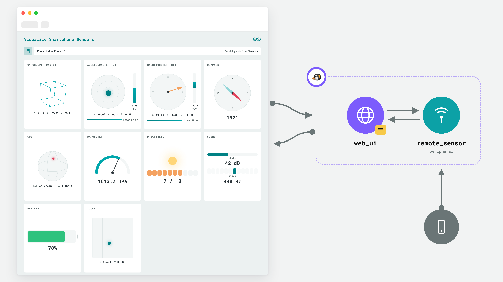

# Visualize Smartphone Sensors

The **Visualize Smartphone Sensors** example turns your smartphone into a wireless multi-sensor device: pair the phone with your board and watch accelerometer, gyroscope, magnetometer, compass, GPS, barometer, brightness, sound, battery and touch data stream into a live, animated web dashboard.

**Note:** This example uses your smartphone as a remote sensor input. Both the board and your smartphone must be connected to the same network.



This example receives live sensor data from the **Arduino IoT Remote** mobile app. The workflow involves pairing your phone to the board via a QR code, streaming sensor readings over the network through the `remote_sensor` peripheral (secured with a one-time password), and rendering each metric in a dedicated animated panel. The App is managed from an interactive web interface.

*This example is based on the Arduino UNO Q, but also works with Arduino VENTUNO Q.*

## Bricks Used

The example uses the following Bricks:

- `web_ui`: Brick to create a web interface to display the pairing QR code and the live sensor dashboard.

It also uses the `remote_sensor` **peripheral**: a WebSocket server hosted on the board that accepts one remote client streaming telemetry. Peripherals are used directly from Python and do not need an entry in `app.yaml`.

## Hardware and Software Requirements

### Hardware

- Arduino UNO Q (x1) or Arduino VENTUNO Q (x1)
- Smartphone (iOS or Android)
- Personal computer with internet access (to view the Web UI)

### Software

- **Arduino App Lab** (running on the board)
- **Arduino IoT Remote App** (installed on your smartphone)

## How to Use the Example

### Arduino App Lab Setup

1. Ensure your board is powered and connected to the network.

2. Run the App by clicking the **Run** button in the top navigation bar.

3. The App should open automatically in the web browser. You can open it manually via `<board-name>.local:7000`.

4. The Web UI will display a **QR Code** and a six-digit **password**.

### Arduino IoT Remote Setup

5. Install the **Arduino IoT Remote** app on your smartphone from your app store.

6. Open the Arduino IoT Remote app on your phone and log in with your Arduino account.

7. Pair your phone with the board in one of two ways:

   - Scan the QR code shown in the Web UI with your phone camera (outside the Arduino IoT Remote app), or
   - In the Arduino IoT Remote app, go to Devices, tap on the plus icon, select **Stream phone data to UNO Q or VENTUNO Q**, pick your board, then enter the **password** the Web UI reports below the QR code.

8. Once connected, the pairing card collapses and the dashboard appears, with one panel per sensor:

   - **Gyroscope**: a 3D wireframe cube that rotates with the phone.
   - **Accelerometer**: a bubble level plus a signed Z bar and linear acceleration.
   - **Magnetometer**: a field-heading needle with a signed Z bar.
   - **Compass**: a rotating compass rose with the heading in degrees.
   - **GPS**: latitude/longitude plotted on a mini globe.
   - **Barometer**: a pressure gauge in hPa.
   - **Brightness**: a sun that grows and glows with ambient light.
   - **Sound**: a VU meter for level and a piano strip for pitch.
   - **Battery**: the phone's charge level.
   - **Touch**: the position of your finger on the phone screen.

9. Move, tilt, and play with your phone and watch every panel react in real time.

## How it Works

This example hosts a Web UI that orchestrates a connection between your phone's sensors and the board. Sensor readings are received over the network by the `remote_sensor` peripheral and forwarded to the browser, where each metric drives an animated panel.

Here is a brief explanation of the full-stack application:

### 🔧 Backend (main.py)

- **Security & Connection**:
  - Generates a random 6-digit **secret** (`generate_secret`) to secure the connection between the phone and the board.
  - Initializes a **RemoteSensor** (`sensor = RemoteSensor(secret=secret)`). This object hosts the WebSocket server the phone streams to, authenticating messages with the secret (HMAC).

- **App Initialization**:
  - **WebUI** (`ui = WebUI()`): Manages the frontend interface.

- **Event Handling**:
  - **Status Updates**: Wires sensor lifecycle changes (connected, streaming) to the UI.
  - **UI Connection**: When a user opens the browser (`ui.on_connect`), the backend sends the connection details (IP, port, secret) so the frontend can generate the pairing QR code, plus the recent history of datapoints so the dashboard fills up immediately.
  - **Datapoints**: Uses `on_datapoint` to parse each JSON message from the phone and forward it to the UI.

---

### 💻 Frontend (index.html + app.js)

- **Pairing Process**:
  - Receives the `secret`, `ip`, and `port` from the backend via WebUI.
  - Generates a **QR Code** using `qrcode.min.js`. This code contains the credentials required for the mobile app to connect.

- **Live Dashboard**:
  - Once the phone connects, the interface switches from the QR code view to the sensor grid.
  - Each incoming datapoint updates only the panels whose fields are present, so partial payloads are fine.

---

## Understanding the Code

Once the application is running, you can open it in your browser. At that point, the device begins performing the following:

- **Serving the UI and handling Remote Sensor pairing.**

  The backend generates a security code and initializes the `remote_sensor` peripheral. It waits for the frontend to connect to send these details.

  ```python
  def generate_secret() -> str:
      characters = string.digits
      return ''.join(secrets.choice(characters) for _ in range(6))


  secret = generate_secret()

  ui = WebUI()
  sensor = RemoteSensor(secret=secret)

  # Send connection details to the UI so it can draw the pairing QR code
  def on_ui_connect(sid):
      ui.send_message("welcome", pairing_payload())
      with history_lock:
          ui.send_message("history", list(history))


  ui.on_connect(on_ui_connect)
  ```

- **Receiving sensor data and broadcasting it to the browser.**

  The peripheral delivers each message from the phone as raw bytes. The callback parses the JSON payload, stores it in a small rolling history, and sends it to the browser.

  ```python
  def on_datapoint(raw: bytes):
      try:
          data = json.loads(raw.decode())
      except Exception:
          return
      if not isinstance(data, dict):
          return
      with history_lock:
          history.append(data)
      ui.send_message("datapoint", data)


  sensor.on_datapoint(on_datapoint)

  sensor.start()
  ```

  A datapoint is a flat JSON object; every field is optional and each dashboard panel updates only when its field is present:

  ```jsonc
  {
    "accelerometerX": -0.12, "accelerometerY": 9.8, "accelerometerZ": 0.04,
    "gyroscopeX": 0.0, "gyroscopeY": 0.0, "gyroscopeZ": 0.01,
    "magnetometerX": 12.1, "magnetometerY": -4.2, "magnetometerZ": 38.0,
    "compass": 132,
    "gps": { "lat": 45.46, "lon": 9.18 },
    "barometer": 1013.2,
    "brightness": 7,
    "soundPitch": 440, "soundLevel": 32,
    "battery": 78,
    "touchX": 0.42, "touchY": 0.63
  }
  ```

- **Rendering the QR Code (Frontend).**

  In `app.js`, the frontend waits for the `welcome` message to generate the QR code that bridges the phone and the board.

  ```javascript
  function showPairing(welcome) {
    const host = welcome.ip && welcome.ip !== '0.0.0.0' ? welcome.ip : window.location.hostname;
    const payload = `https://cloud.arduino.cc/installmobileapp?otp=${welcome.secret}&protocol=${welcome.protocol}&ip=${host}&port=${welcome.port}`;
    new QRCode(qrEl, { text: payload, width: 184, height: 184 });
  }

  ui.on_message('welcome', showPairing);
  ```

- **Animating the dashboard (Frontend).**

  Every `datapoint` message is dispatched to the panel updaters; each one reads only the fields it cares about.

  ```javascript
  function applyDatapoint(d) {
    updateAccel(d);
    updateGyro(d);
    updateMag(d);
    // ... sound, battery, barometer, brightness, compass, GPS, touch ...
  }

  ui.on_message('datapoint', applyDatapoint);
  ```

- **Executing the event loop.**

  Finally, the backend keeps the application alive, managing the network traffic between the phone and the browser.

  ```python
  App.run()
  ```

## Note

This example is written to use HTTP protocol for example purposes.
If you want to manage a secure HTTPS connection:

- create a copy of this example
- create certificates files `cert.pem` `key.pem` and save them into `/app/certs`
- instantiate `WebUi` brick in this way:

```python
ui = WebUI(use_tls=True, certs_dir_path='/app/certs')
```

The `remote_sensor` peripheral also supports TLS for the phone connection (`RemoteSensor(use_tls=True)`).
