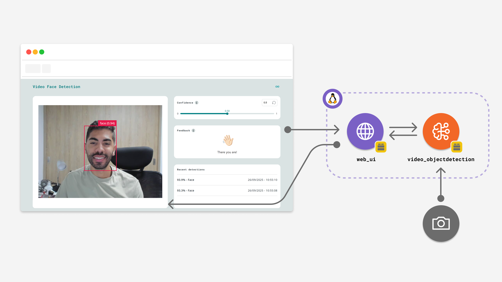
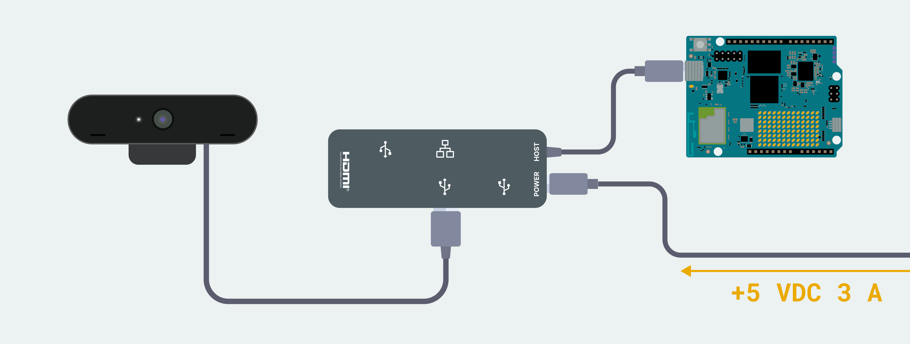
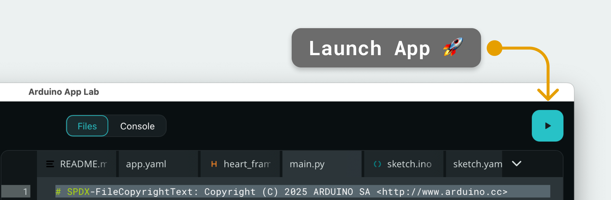

# Face Detector on Camera



The **Face Detector on Camera** example detects faces on a live camera feed and draws a bounding box around each one in real time. When a face is found, the web interface greets you and logs the detection with its confidence score.

**Note:** This example requires to be run using **Network Mode** in the Arduino App Lab because you will need a [USB-C® hub](https://store.arduino.cc/products/usb-c-hub-8-in-1) and a USB camera.

## Description

This App uses the `video_objectdetection` Brick with the `face-detection` model. The Brick captures frames from the USB camera, runs the model on each frame and streams the annotated video to the browser, while the `web_ui` Brick serves the interface and exchanges messages with it over WebSocket.

**Key features include:**

- Live camera preview with bounding boxes and confidence scores drawn around detected faces.
- A confidence control (slider, numeric input and reset button) that changes the detection threshold while the App is running.
- A feedback panel that shows a waving hand and a random greeting when a face is detected.
- A list of the last five detections, with confidence score and local time.

## Bricks Used

- `video_objectdetection`: detects faces in the camera stream and draws the bounding boxes on the video.
- `web_ui`: serves the web interface and exchanges detection and threshold messages with the browser over WebSocket.

## Hardware Requirements

### Hardware

- [Arduino® UNO Q](https://store.arduino.cc/products/uno-q)
- USB camera (x1)
- [USB-C® hub](https://store.arduino.cc/products/usb-c-hub-8-in-1) adapter with external power (x1)
- A power supply (5 V, 3 A) for the USB hub (e.g. a phone charger)
- Personal computer with internet access

## How to Use the Example

1. **Connect the camera**

   Connect the [USB-C® hub](https://store.arduino.cc/products/usb-c-hub-8-in-1) to the UNO Q and the USB camera, then attach the external power supply to the hub to power everything. Make sure the camera is connected before running the App.

   

2. **Run the App**

   Launch the App by clicking the **Run** button in the top right corner of Arduino App Lab. The first launch can take a few minutes, as the board downloads the container that runs the model.

   

3. **Open the web interface**

   The App opens automatically in your browser. You can also open it manually at `<board-ip>:7000`.

4. **Show your face**

   Position yourself in front of the camera. A bounding box appears around your face, the feedback panel greets you and the detection is added to the **Recent detections** list.

5. **Adjust the confidence**

   Use the **Confidence** slider or type a value to change the minimum score a detection needs to be shown. Click the reset button to return to the default value of `0.50`.

## How it Works

```
   Camera   ──►   video_objectdetection Brick   ──►   Model runner
                           │                                │
                           │ detections                     │ annotated video stream (port 4912)
                           ▼                                ▼
                      WebUI Brick   ───────────────►   Frontend (Browser)
                           ▲                                │
                           └──────── override_th ───────────┘
```

1. The `video_objectdetection` Brick captures frames from the camera and sends them to the model runner, which runs the `face-detection` model.
2. The model runner draws the bounding boxes on the video and serves it on port `4912`, where the web page embeds it.
3. The Brick reports every detection above the confidence threshold to `main.py`, which forwards it to the browser as a `detection` message.
4. The frontend updates the feedback panel and the list of recent detections, and sends an `override_th` message to the backend when you change the confidence.

## Understanding the Code

### 🔧 Backend (`main.py`)

The backend initializes the two Bricks. The `VideoObjectDetection` Brick starts with a confidence threshold of `0.5` and no debounce, so every detection is reported:

```python
ui = WebUI()
detection_stream = VideoObjectDetection(confidence=0.5, debounce_sec=0.0)
```

When the user changes the confidence in the web interface, the `override_th` message updates the threshold of the running model:

```python
ui.on_message("override_th", lambda sid, threshold: detection_stream.override_threshold(threshold))
```

The Brick offers two kinds of callbacks. `on_detect("face", ...)` is called when a face is detected: in this example `face_detected()` is an empty placeholder where you can add your own logic, such as sending a notification. `on_detect_all(...)` receives all detections of a frame as a dictionary that maps each label to a list of detections. `send_detections_to_ui()` sends each detection to the browser with its confidence and a UTC timestamp:

```python
def send_detections_to_ui(detections: dict):
  for key, values in detections.items():
    for value in values:
      entry = {
        "content": key,
        "confidence": value.get("confidence"),
        "timestamp": datetime.now(UTC).isoformat()
      }
      ui.send_message("detection", message=entry)

detection_stream.on_detect_all(send_detections_to_ui)
```

Finally, `App.run()` starts the Bricks and keeps the App running.

### 💻 Frontend (`index.html` + `app.js`)

The page embeds the annotated video from port `4912` in an `<iframe>`. Until the stream is available, it shows a placeholder and retries every second.

`app.js` connects to the backend through the `WebUI` library and handles each `detection` message:

```javascript
const ui = new WebUI();

ui.on_message('detection', handleDetection);
```

For each detection, `handleDetection()`:

- Adds the detection to the **Recent detections** list, which keeps the last five entries with their confidence and local time.
- Shows the waving hand and a random greeting in the feedback panel, and restores the default message after 3 seconds without detections.

The **Confidence** control sends the new threshold to the backend with `ui.send_message('override_th', value)`. Both the confidence control and the feedback panel have an info icon that explains them on hover. If the connection to the board is lost, an error banner appears at the bottom of the page.

### 🛠️ Customizing the Example

- Change the default threshold or add a debounce between repeated detections with the `confidence` and `debounce_sec` arguments of `VideoObjectDetection` in `main.py`.
- Add your own logic to `face_detected()`, for example to trigger an action whenever someone appears in front of the camera.
- Edit the `greetings` list in `app.js` to change the messages shown in the feedback panel, or `MAX_RECENT_SCANS` to show more detections.

## Troubleshooting

### The App does not start and reports "No Camera Device Found"

The camera is not detected. Check that the USB camera is connected to the USB-C® hub and that the hub is powered, then run the App again.

### The video does not appear

The web page waits for the model runner to be ready and retries every second. On the first launch, the board also needs to download the container that runs the model, so the video can take a few minutes to appear.

### Faces are not detected

Face the camera with your face well lit and fully visible. If detections are still missing, lower the **Confidence** value in the web interface.
