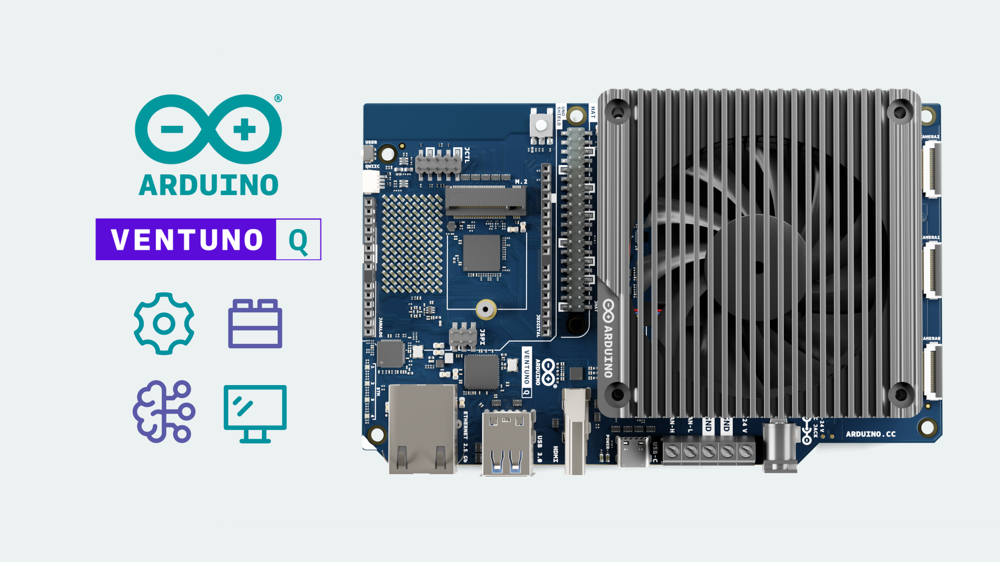
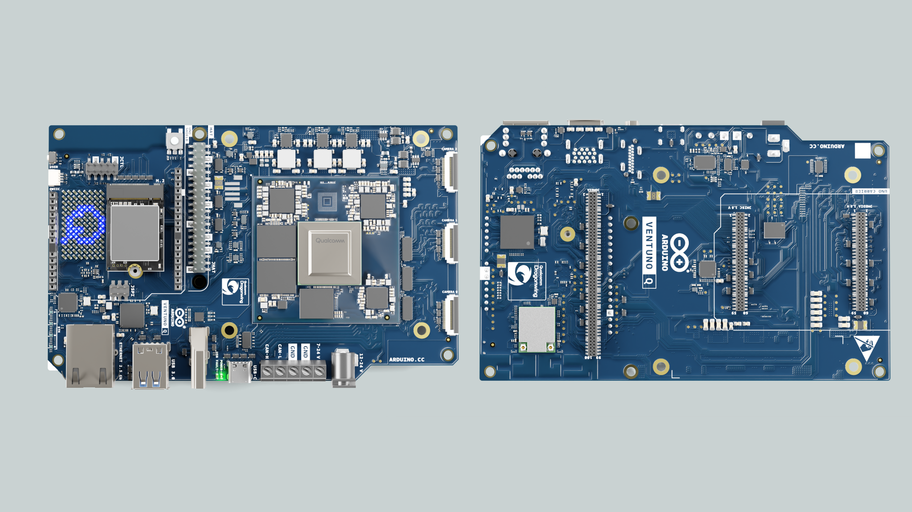
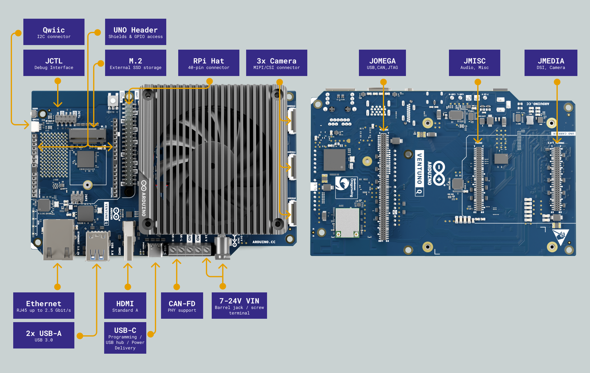

The **Arduino VENTUNO Q** is a high-performance edge AI computer featuring the Qualcomm Dragonwing™ IQ8 (QCS8275) System-on-Chip (referred to as the "MPU" or "Linux side"), and an STM32H5F5 microcontroller (MCU). This dual-architecture platform brings together Linux and microcontroller worlds through a built-in RPC library, enabling powerful AI and robotics applications with **Arduino App Lab**.

The duality of the board enables us to create projects that can, for example:
- Run local LLMs and VLMs with up to 40 dense TOPS of AI compute **(Linux side)**
- Perform real-time computer vision and image segmentation **(Linux side)**
- Handle precise motor control and robotics **(MCU side)**
- Stream data to a web interface or cloud **(Linux side)**

> This guide provides a brief overview of the VENTUNO Q board. For more detailed information, please visit the [official documentation page for VENTUNO Q](https://docs.arduino.cc/hardware/ventuno-q/)

## Arduino VENTUNO Q Overview

The VENTUNO Q is designed for edge AI and robotics, and can also be used as a standalone single board computer by connecting a monitor, keyboard, and mouse. Key features include:
- **Qualcomm Dragonwing™ IQ8 (QCS8275)** with octa-core CPU, Adreno GPU, and 40 TOPS NPU running Ubuntu Linux
- **STM32H5F5** Arm® Cortex®-M33 Microcontroller Unit (MCU) at 250 MHz
- **16 GB LPDDR5 RAM** and **64 GB eMMC** storage
- **Wi-Fi® 6** (2.4/5/6 GHz) and **Bluetooth® 5.3**
- HDMI, USB 3.0, USB-C, Ethernet, M.2 NVMe, CAN-FD, and more (see [Connectors & Interfaces](#connectors--interfaces))
- A blue 13x8 LED matrix and 4x user-controllable RGB LEDs

## Pinout

### Important Notes

The board has different operating voltages:
- The MCU operates at **3.3V**, meaning the UNO Shield header GPIOs and analog pins are 3.3V only.
- The SoC operates at **1.8V**, meaning the high-speed carrier headers on the bottom of the board are 1.8V only.

> The difference in voltage is particularly important when using the carrier headers. As they operate on 1.8V, connecting higher voltage components can damage the board.

## AI & NPU

The VENTUNO Q features the **Hexagon Tensor AI Processor (NPU)** capable of up to **40 dense TOPS**, enabling powerful on-device AI without relying on the cloud. This makes it suitable for applications such as:
- **Local LLMs and VLMs** for offline AI assistants and reasoning
- **Speech-to-Text and Text-to-Speech** for voice-controlled interfaces
- **Real-time computer vision** including object detection, image segmentation, and face recognition
- **Robotics** with vision-guided manipulation and autonomous navigation

AI models can be deployed using frameworks like ONNX Runtime, Qualcomm AI Hub, llama.cpp, and Ollama, all running locally on the board.

## Connectors & Interfaces

The VENTUNO Q is equipped with a wide range of connectors, making it easy to set up as a standalone workstation or embed into a larger system:

- **2x USB 3.0 Type-A** — connect a mouse, keyboard, USB camera, or external storage
- **1x USB-C** — connect to a computer, or use for video output (DP Alt mode) and power delivery (9–20 VDC)
- **1x HDMI** — connect a monitor for a full desktop experience
- **1x 2.5 Gbit RJ45 Ethernet** — wired network connectivity
- **M.2 Key M (2230)** — add NVMe Gen.4 storage for large AI models and datasets
- **CAN-FD screw terminal** — industrial and automotive communication
- **RPi 40-pin header** — compatible with RPi HATs
- **UNO Shield headers** — compatible with Arduino UNO Shields (3.3V logic)
- **Carrier headers (JMEDIA, JMISC, JOMEGA)** — high-speed camera (MIPI CSI), display (MIPI DSI), audio, and motor control interfaces
- **Qwiic connector** — connect [Modulino nodes](https://store.arduino.cc/collections/modulino) and other I2C sensors without soldering