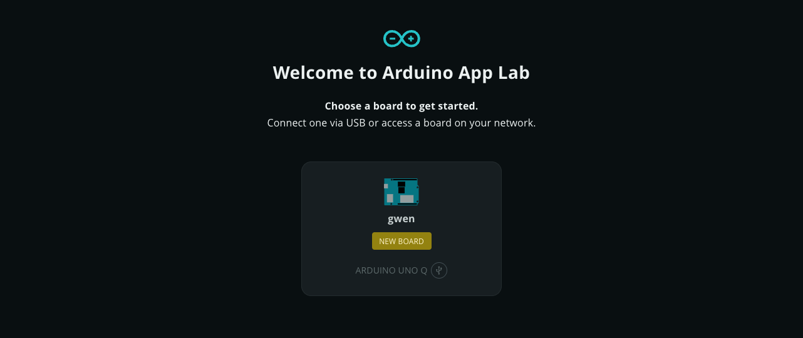
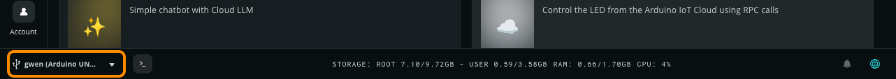
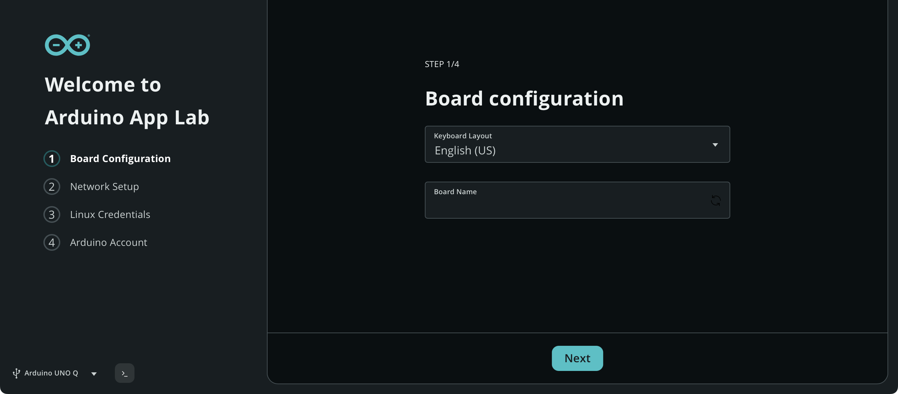
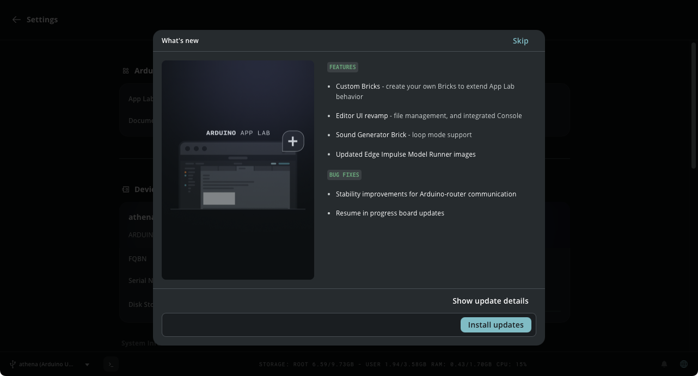

Once Arduino App Lab is running, it will automatically detect and prepare your board for development. If you are using App Lab in Single Board Computer (SBC) mode, the software is already running on the board and no manual connection step is required. If you are working from a separate computer, you will first need to select and connect to your board over USB or your local network.

After connecting, App Lab performs an automated check to ensure your board is correctly configured. While you will typically walk through these steps during your first session, App Lab may prompt you again if certain requirements are missing—for example, if a network connection is unavailable or if a Linux password needs to be set for Network Mode deployment and remote access via SSH.

## Board Selection (Connected Mode)

> **Note:** Skip this step if you are running Arduino App Lab in Single Board Computer mode.

1. Connect your board to your computer using a USB-C cable.
2. Wait for the board to boot (this may take up to 60 seconds).
3. If prompted by your system, allow the board to connect to your computer.
4. Detected boards will appear in Arduino App Lab. Depending on the board configuration, they may have one or more connection options:
   - **USB:** Indicated by a USB icon next to the board model.
   - **Network:** Indicated by a Wi-Fi icon next to the board model.
   
5. Select a board to connect to it.

> **Note:** Network Mode will only be available once the board has been configured with a Wi-Fi network. Please connect via USB for the initial setup to configure these settings.

On subsequent connections, Arduino App Lab automatically selects the last used board and app if detected at startup. To manually switch between detected boards, use the board selection control located in the bottom-left corner.

## Board Configuration

A setup wizard will automatically launch if the board has not been configured, is missing network working network credentials, or requires a Linux password.

Follow these steps to complete the setup:

1. **Board Configuration:**
   - _Keyboard Layout._ Choose your preferred keyboard layout. This is essential if you plan to use the board in Standalone (SBC) mode with a physical keyboard.
   - _Board Name._ Assign a unique name to your board. This name will identify your board in the App Lab interface and on your local network (e.g., `my-board.local`).
   
2. **Network Setup:** Select your local Wi-Fi network and enter the password. An internet connection is required for downloading "Bricks" and system updates. When your board connects to the Internet, it will automatically check for software updates.
3. **Set Linux Password:** Create a custom password for the default `arduino` user account.
   > **Important:** The Linux password is required for Network Mode, SSH access, and logging into the Debian desktop in SBC mode. Ensure you save it securely.
4. **Arduino Account:** Sign in with your Arduino account to enable additional features. If Arduino App Lab does not prompt you to sign in, you can do this later from the **Account** tab in the sidebar.

## Manage Software Updates

Arduino App Lab automatically manages the software ecosystem on your board to ensure you have the latest features, security patches, and performance improvements.

If updates are available, Arduino App Lab will ask if you want to install the available updates: 

* Select **Install** to download and install the updates, or **Skip** if you don't want to update the board.
* Select **Show update details** for additional information about the updates.

The update process is resumable—if the connection is interrupted, the download will continue once reconnected.

> **Note:** An active internet connection is required for the board to download update packages.
