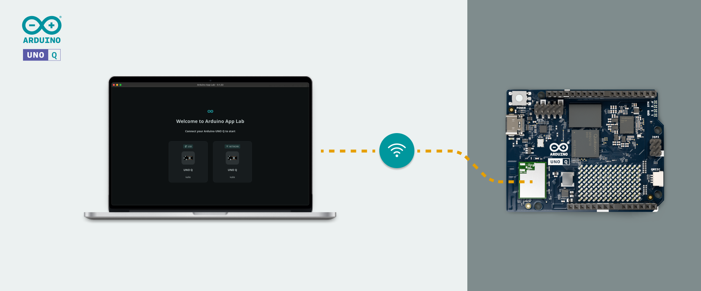
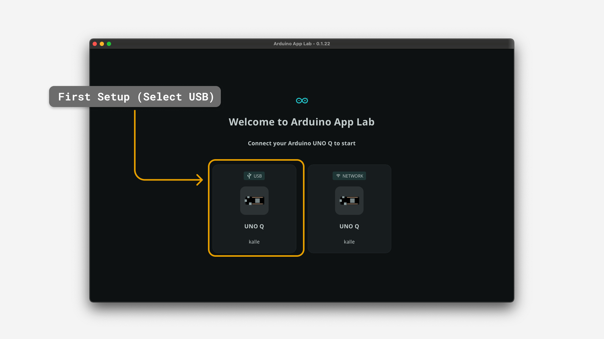
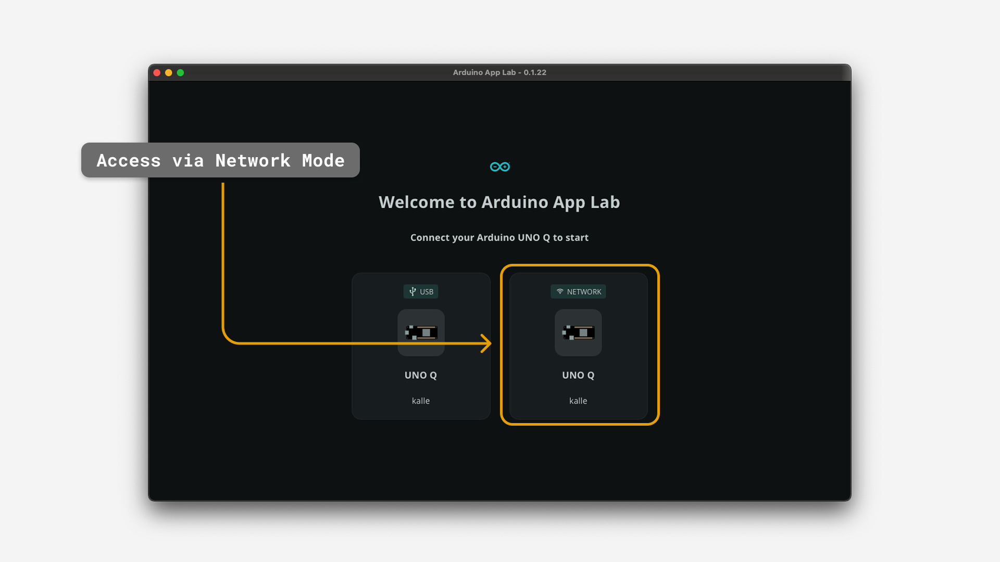
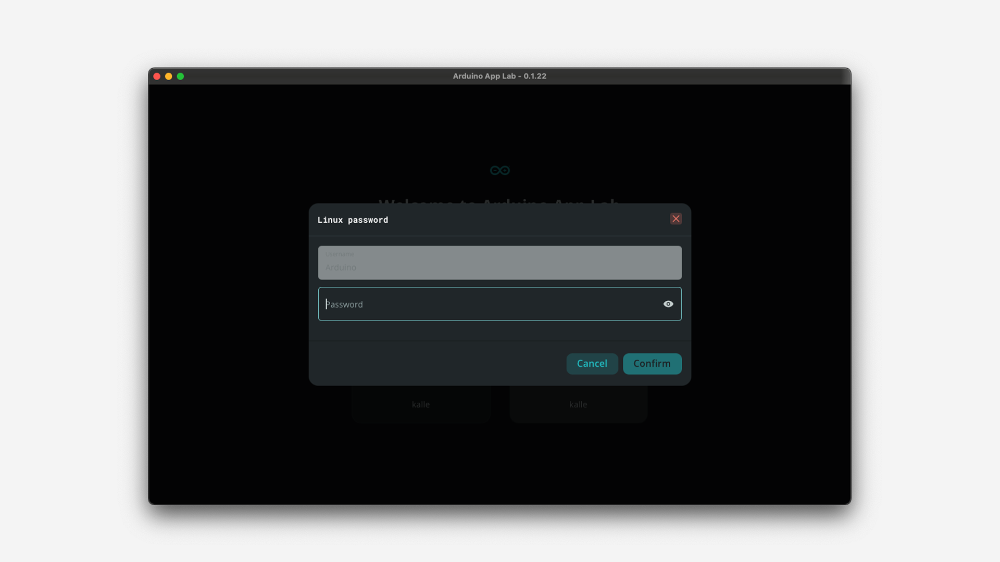
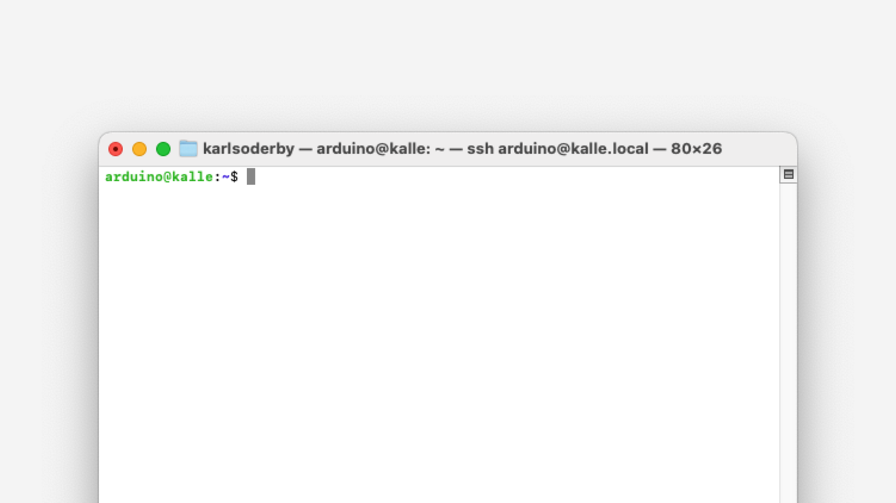

**Network Mode** is a mode that allows us to access the Arduino® UNO Q over the local network, using the Arduino App Lab (Desktop) application.

This mode is preferred when the board is set up as a [Single Board Computer (SBC)](/learn/single-board-computer), or when it cannot be physically connected to our computer.

> To use Network Mode, we need to complete the first setup of the board, where we enter Wi-Fi® credentials and a name for our board. This will automatically enable `ssh` which is required to use this mode.

## Recap on Different Modes

In other tutorials (such as [First Setup](/learn/first-setup)), we cover the **three different modes** that we can use to program the UNO Q:
- **Desktop Mode (over USB)** - we program the board, using the Arduino App Lab desktop application on our host computer (Mac/Windows/Linux)
- **Network Mode (over SSH / local network)** - we connect to the board over the local network, using SSH. This requires no physical connection (USB) with the board.
- **Standalone Mode (board as SBC)** - board is setup with a monitor, keyboard and mouse, and can be programmed by using the Arduino App Lab on the board itself.

## How to Set Up 

Setting up Network Mode only takes a minute, and it works exactly the same as using a physical USB-C® cable.

### First Time Using the Board

If this is our first time using the board, we first need to complete the **"First Setup"**, which requires the board to be connected to our host computer via a USB-C® cable.

To achieve this, simply start the Arduino App Lab, select the **USB** option (only one is available during first setup).



Complete the setup, which includes providing Wi-Fi® credentials and a name/password for the board. The board may also look for updates, which will be automatically downloaded and applied.

### Set up Network Mode

After the first setup is completed, restart the Arduino App Lab. Wait for the board to appear. If our computer and the board is on the same network, it will appear next to the USB option (marked with **Network**).



After selecting the Network mode, we will be asked to provide the password for the board (which is chosen during the first setup).



After entering the password, we will have access to the board remotely, and we can create and launch Apps in exactly the same manner. The key difference is that we are now connecting with the board over **Secure Shell (SSH)**, and not over USB.

> Note that the computer and board will need to remain on the same local network.

## Using Network Mode and SBC

Network Mode and SBC Mode can be used simultaneously, and it is a great way of testing out our Apps.

Once the board is setup as an SBC  (monitor, keyboard & mouse), we can also access it from the Arduino App Lab desktop application. This allows us to program the board using our regular computer, but viewing the results on our board.

## Connect via SSH / Terminal (Advanced)

It is also possible to connect to the UNO Q board using SSH in the terminal. This requires SSH to be installed on our computer (in MacOS and several Linux OS, this tool is already installed). 

Note that this requires the use of a **terminal**, and cannot be done inside the Arduino App Lab.

To connect via SSH, open a terminal, and type the following:

```sh
# replace <boardname> with your username
ssh arduinœ@<boardname>.local
```

The first time we attempt to connect to the board, we will be prompted to generate an SSH key. Follow the instructions in the terminal, and we will be able to enter the shell of the board.

Once we are in, we should see this in our terminal:



> Note that we will need to enter the password for the board anytime we want to connect to it. This is the password set during the first setup.

### Troubleshooting Failed SSH Connection

If the SSH connection fails, there are some common things to check out:
- Has the first setup been completed? If not, go to [First Setup](/learn/first-setup) and see the instructions. The first setup will enable SSH on the board which is required to connect.
- If the SSH connection gets stuck even though first setup has been completed, it may be a local network issue. Check that the board is connected to the same network as our computer.

For more information and troubleshooting steps, visit the [SSH guide (UNO Q official documentation)](https://docs.arduino.cc/tutorials/uno-q/ssh/). 